# Basics of NESTJS

## 4 - Project Setup

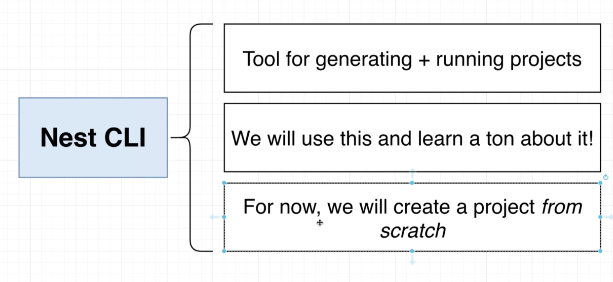

```shell
npm i @nestjs/common @nestjs/core @nestjs/platform-express reflect-metadata typescript
```

updated package.json

```json
  },
"keywords": [],
"author": "",
"license": "ISC",
"dependencies": {
"@nestjs/common": "^9.3.12",
"@nestjs/core": "^9.3.12",
"@nestjs/platform-express": "^9.3.12",
"reflect-metadata": "^0.1.13",
"typescript": "^5.0.3"
}
}
```

## 5 - TypeScript Configuration

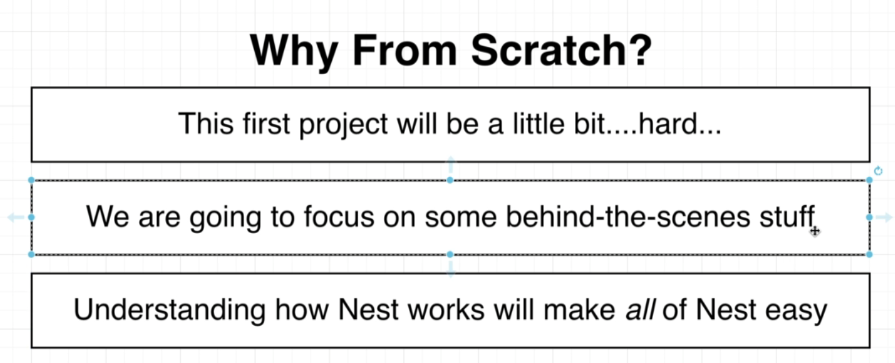
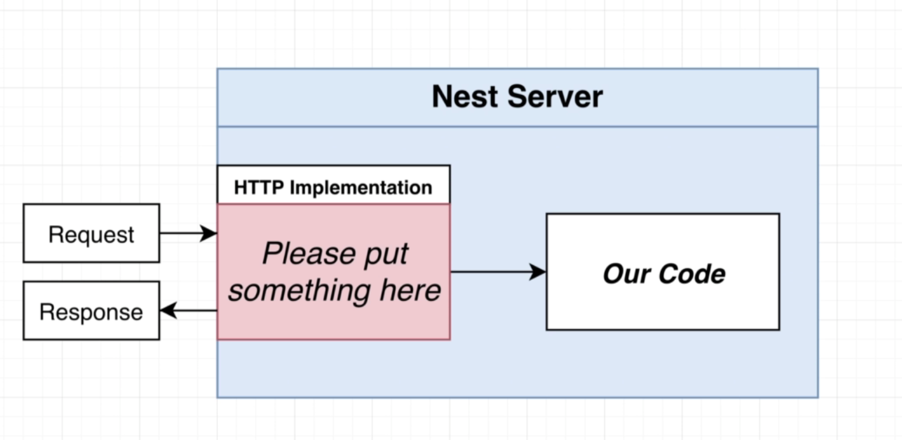
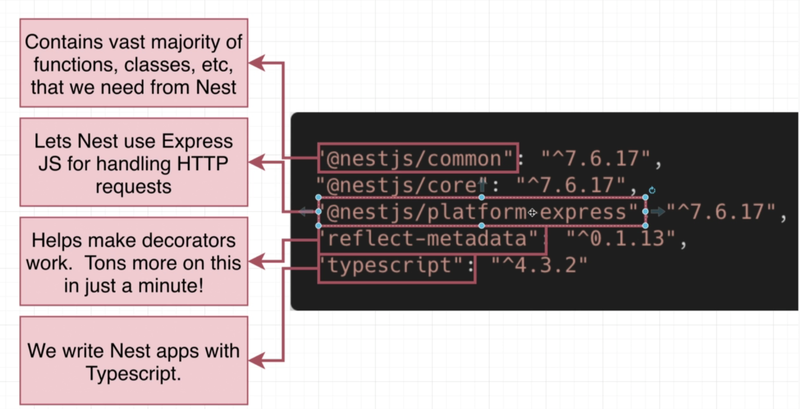
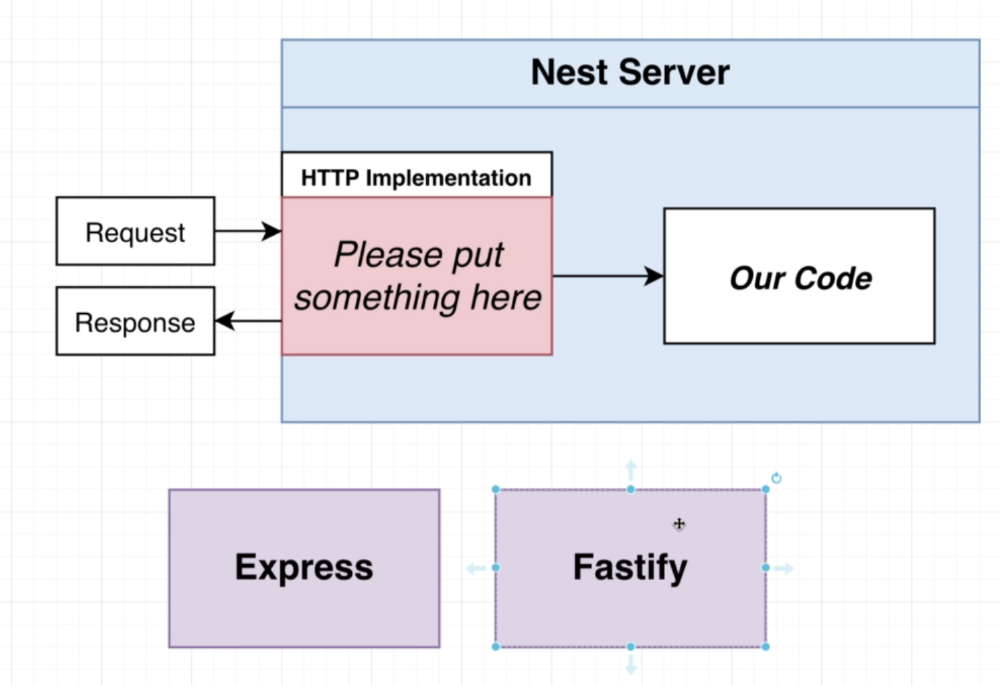
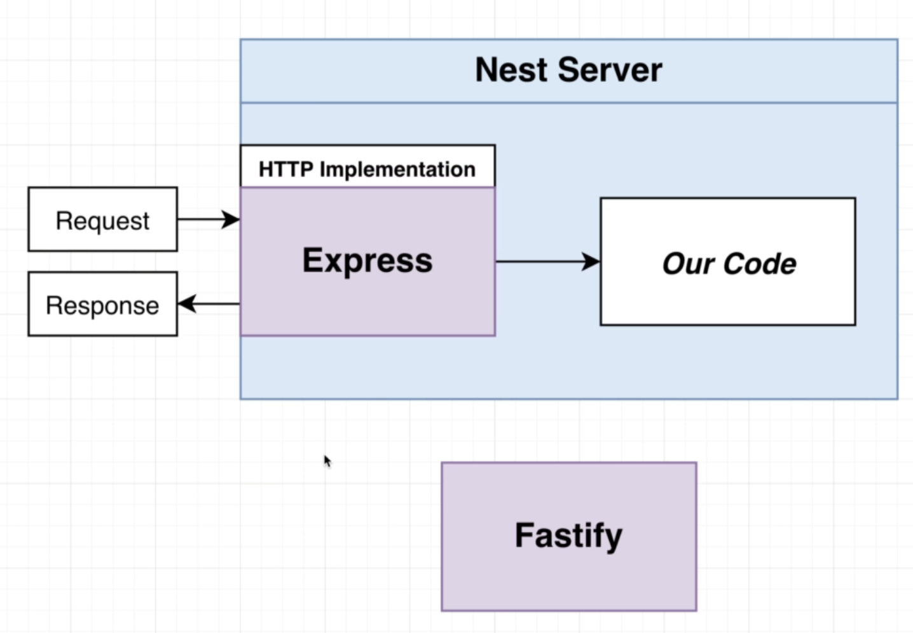
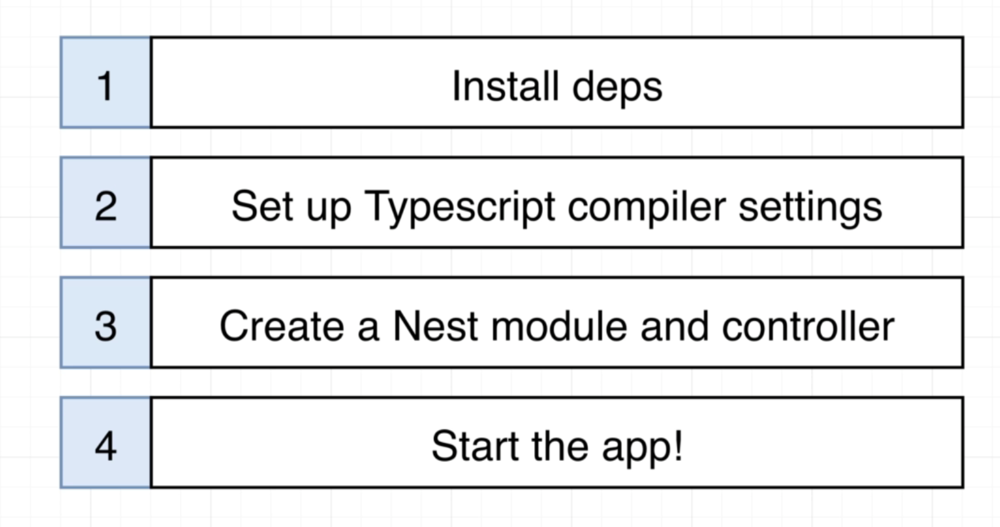

and create a tsconfig file

2 - The Basics of Nest\tsconfig.json

```json
{
  "compilerOptions": {
    "module": "CommonJS",
    "target": "ES2017",
    "experimentalDecorators": true,
    "emitDecoratorMetadata": true
  }
}
```

## 6 - Creating a Controller

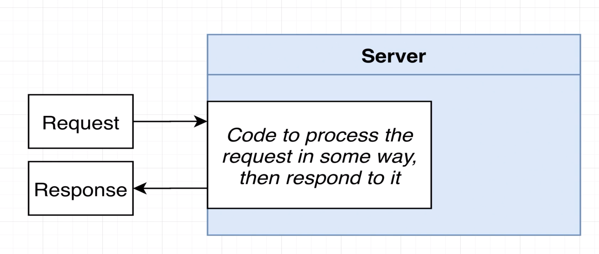
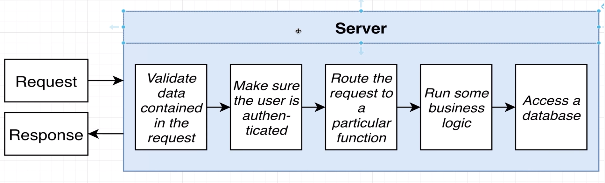
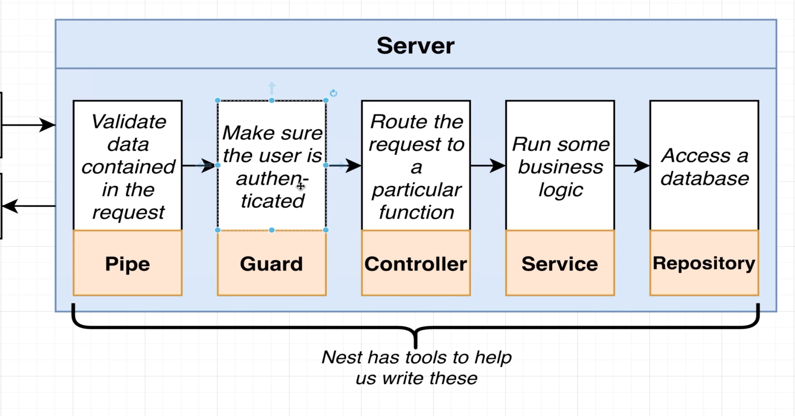
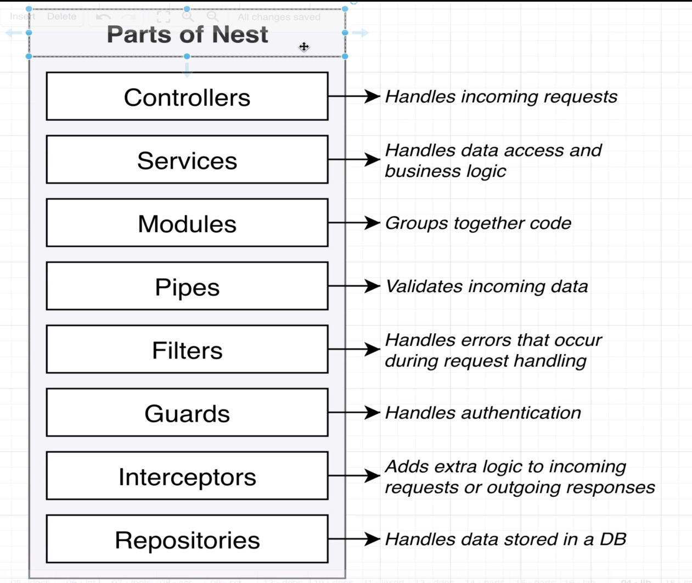

2 - The Basics of Nest\src\main.ts

```ts
import {Module, Controller, Get} from '@nestjs/common';

@Controller()
class AppController {
    @Get()
    getRootRoute() {
        return 'Hello World';
    }
}
```

## 7 - Starting Up a Nest App

let's add a module
2 - The Basics of Nest\src\main.ts

```ts
import {Module, Controller, Get} from '@nestjs/common';
import {NestFactory} from "@nestjs/core";

@Controller()
class AppController {
    return
    'Hello World';
}

}

@Module({controllers: [AppController]})
class AppModule {
}

async function bootstrap() {
    const app = await NestFactory.create(AppModule);
    await app.listen(3000);
}

bootstrap();
```

## 8 - File Naming Conventions

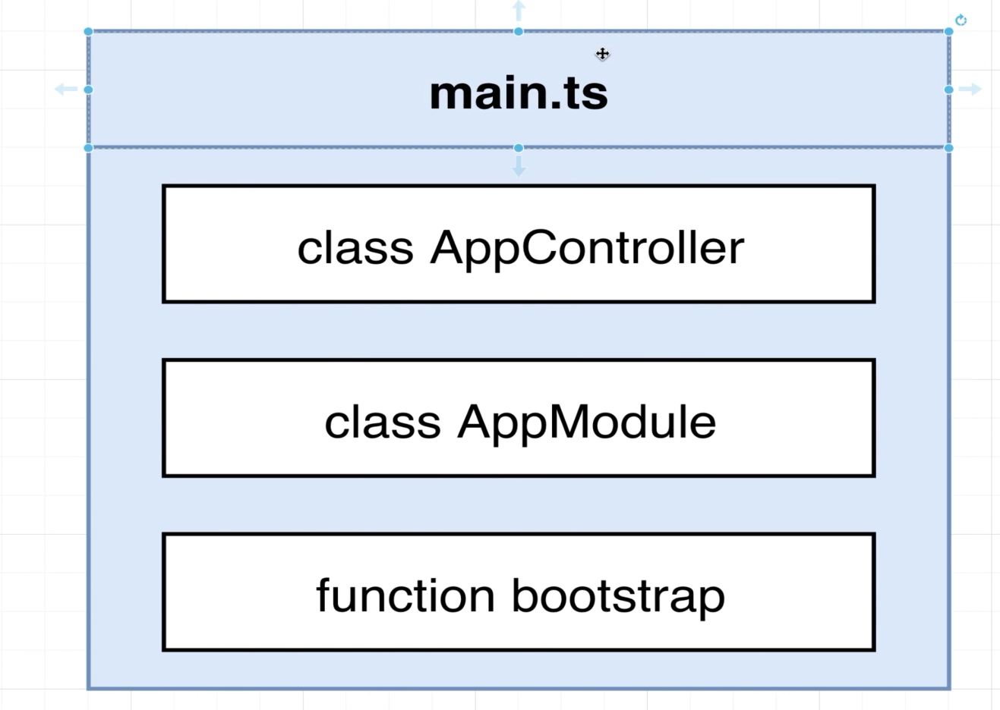
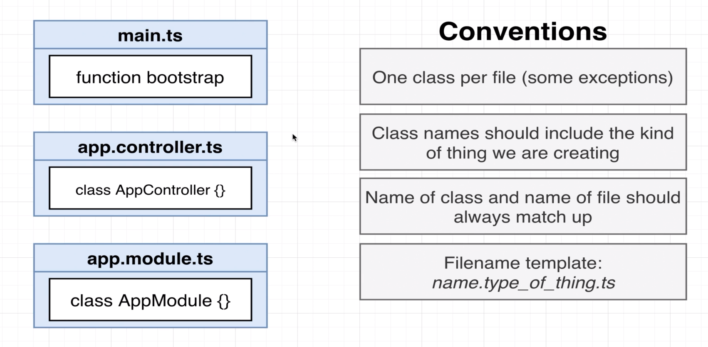

let's refactor the code

2 - The Basics of Nest\src\app.controller.ts

```ts
import {Controller, Get} from "@nestjs/common";

@Controller()
export class AppController {
    @Get()
    getRootRoute() {
        return 'Hello World';
    }
}
```

2 - The Basics of Nest\src\app.module.ts

```ts
import {Module} from "@nestjs/common";
import {AppController} from "./app.controller";

@Module({controllers: [AppController]})
export class AppModule {
}
```

2 - The Basics of Nest\src\main.ts

```ts
import {NestFactory} from "@nestjs/core";
import {AppModule} from "./app.module";

async function bootstrap() {
    const app = await NestFactory.create(AppModule);

// other code
```

## 9 - Routing Decorators

let's add a new routes

2 - The Basics of Nest\src\app.controller.ts

```ts
import {Controller, Get} from "@nestjs/common";

@Controller('/api/v1')
export class AppController {
    @Get('/hello')
    getRootRoute() {
        return 'Hello World';
    }

    @Get('/bye')
    getHelloRoute() {
        return 'Bye World'
    }
}
```
