# Generating Projects with the Nest CLI

## 10 - App Setup

```shell
npm i -g @nestjs/cli

nest new messages
```

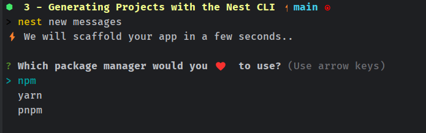
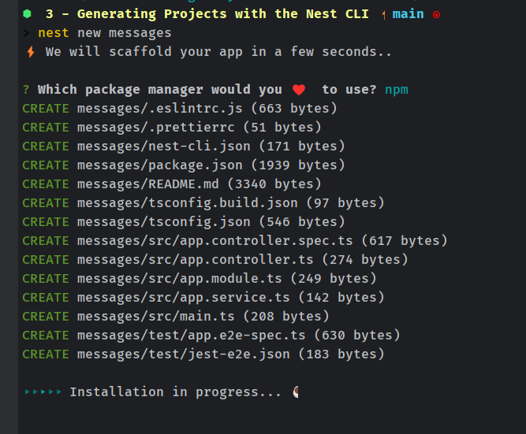
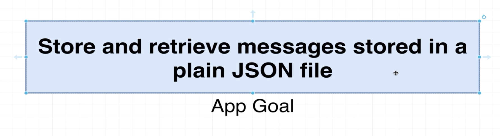
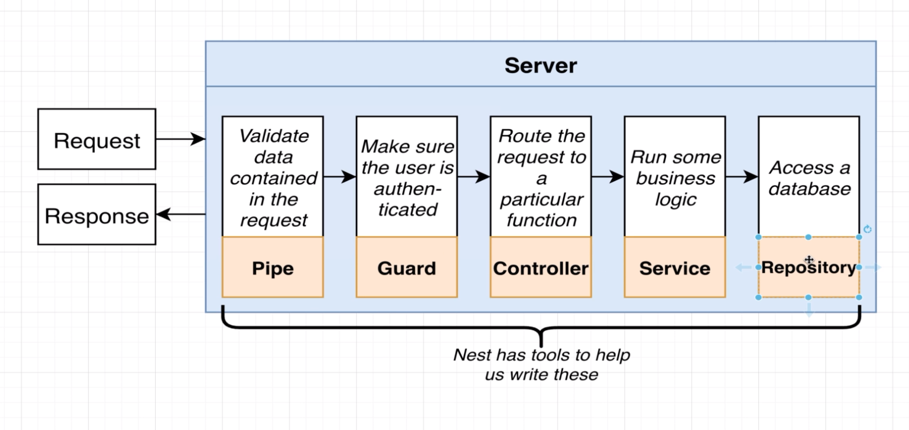
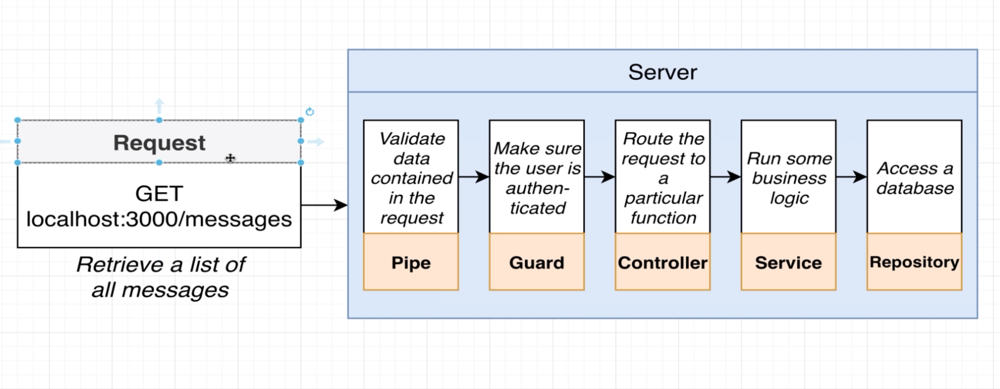
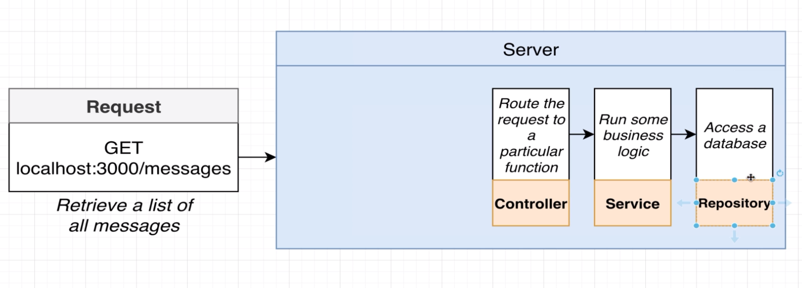
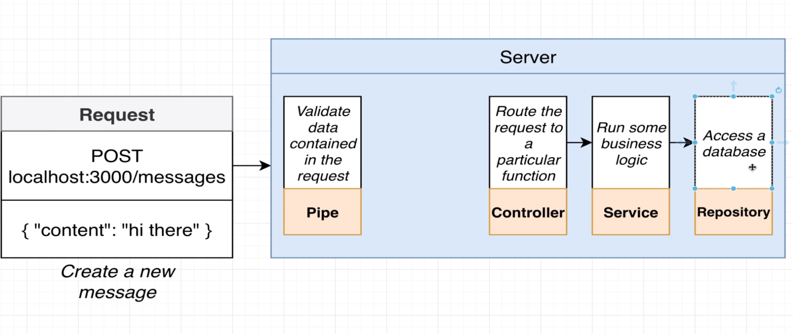
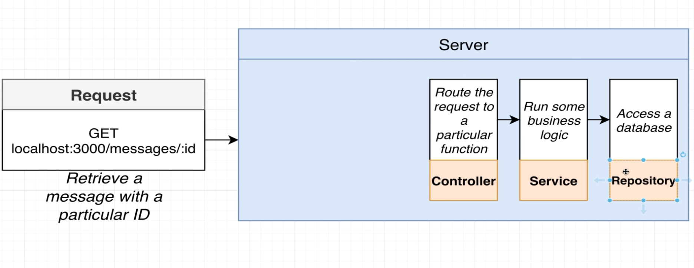
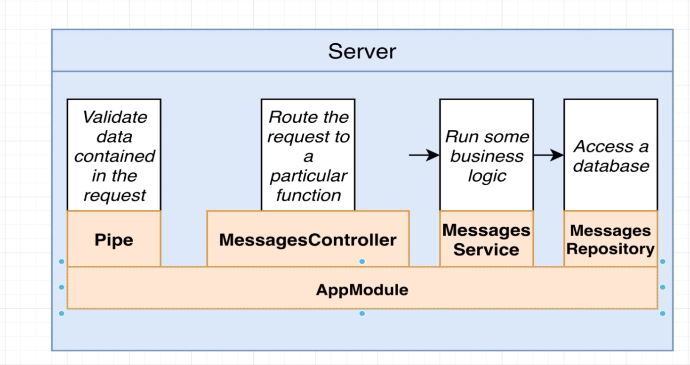

## 11 - Using the Nest CLI to Generate Files

```shell
nest generate module messages
```

it will generate a module called messages

```ts
import {Module} from '@nestjs/common';

@Module({})
export class MessagesModule {
}
```

let's use it in the app module

```ts
import {Module} from '@nestjs/common';
import {MessagesModule} from './messages/messages.module';

@Module({
    imports: [MessagesModule],
})
export class AppModule {
}
```

## 12 - More on Generating Files

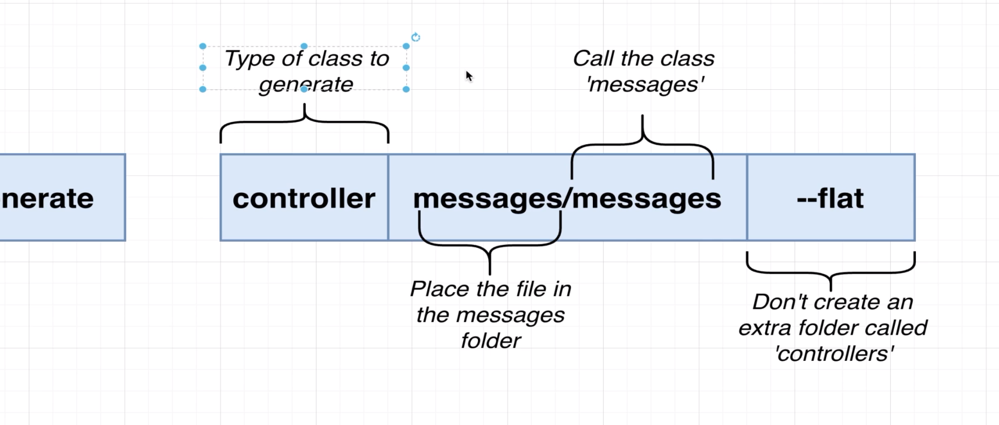
let's generate a controller

```shell
nest generate controller messages/messages --flat
```

--flat means that the controller will be created in the same folder as the module
messages/messages means that the controller will be created in the messages folder

## 13 - Adding Routing Logic

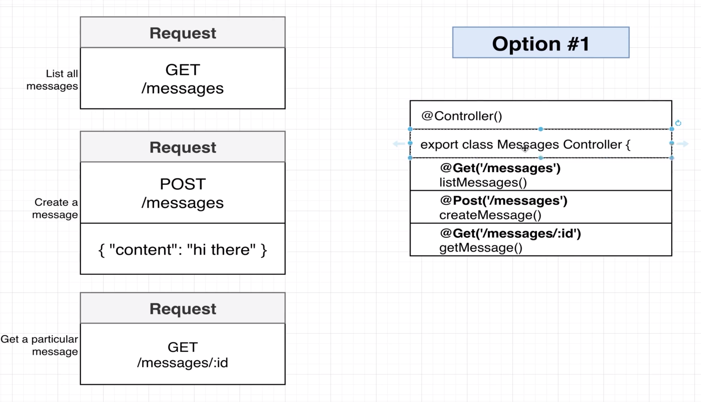
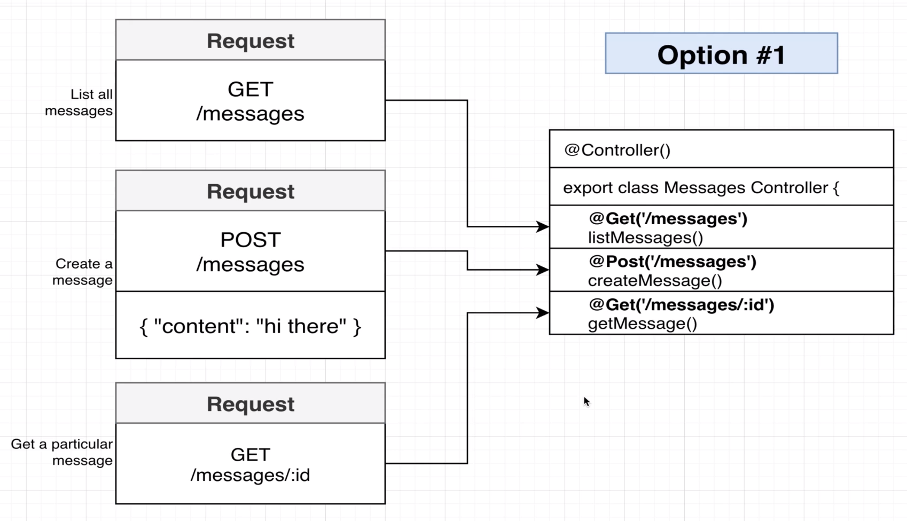
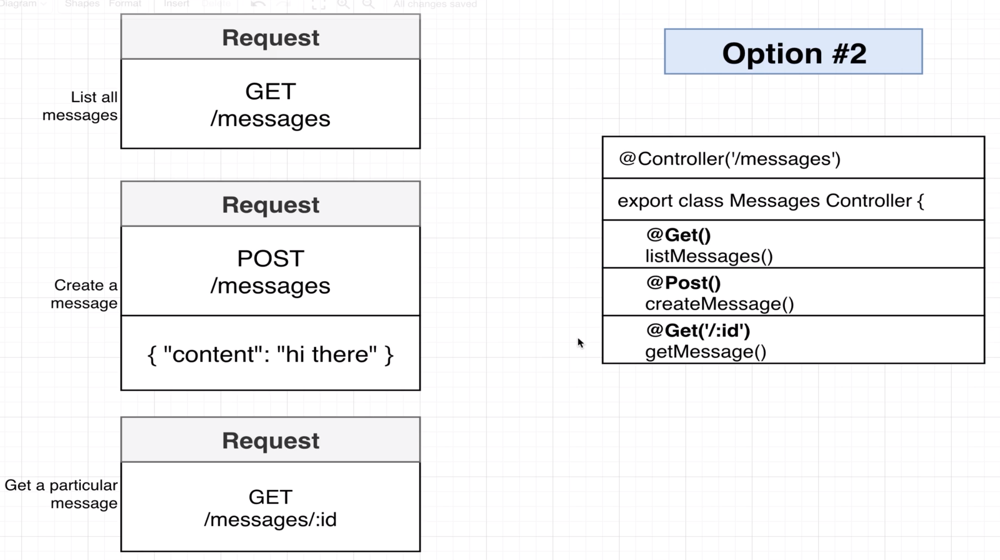
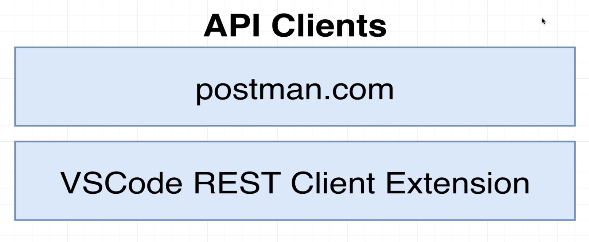
messages.controller.ts

```ts
import {Controller, Get, Post} from '@nestjs/common';

@Controller('messages')
export class MessagesController {
    @Get()
    listMessages() {
        return [
            {
                id: 1,
                text: 'Message 1'
            },
            {
                id: 2,
                text: 'Message 2'
            }
        ]
    }

    @Get(':id')
    getMessage() {
        return {
            id: 1,
            text: 'Message 1'
        }
    }

    @Post()
    createMessage() {
        return {
            id: 1,
            text: 'Message 1'
        }
    }
}

```

## 14 - Optional Postman Setup


## 15 - Optional VSCode REST Client Extension

```http request

### list al the messages
GET http://localhost:3000/messages

### get a message by id
GET http://localhost:3000/messages/1

### create a message
POST http://localhost:3000/messages
content-type: application/json
{
  "content": "hello world"
}

```

# 4 - Validating Request Data with Pipes

## 16 - Accessing Request Data with Decorators
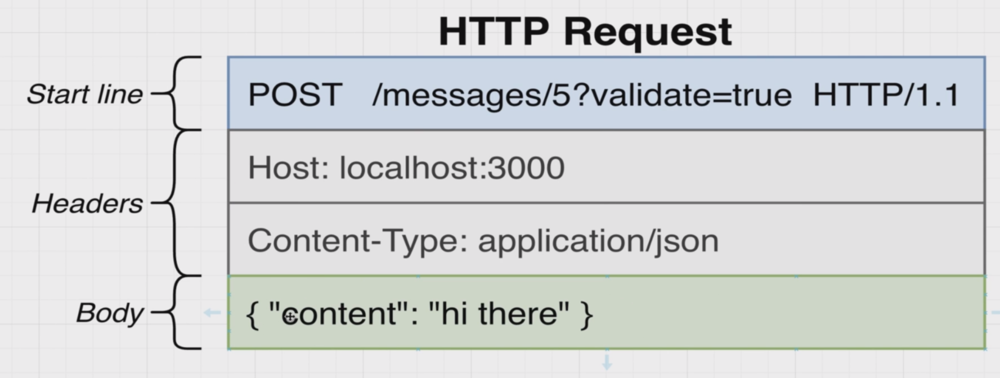
```ts
import {Body, Controller, Get, Post} from '@nestjs/common';

interface BodyI {
    content: string;
}

@Controller('messages')
export class MessagesController {
    @Get()
    listMessages() {
        return [
            {
                id: 1,
                text: 'Message 1',
            },
            {
                id: 2,
                text: 'Message 2',
            },
        ];
    }

    @Get(':id')
    getMessage() {
        return {
            id: 1,
            text: 'Message 1',
        };
    }

    @Post()
    createMessage(@Body() body: BodyI) {
        console.log(body);
        return {
            id: 1,
            content: 'hello world',
        };
    }
}

```

adding the @Body() decorator will automatically parse the body of the request and return it as an object
adding the @type() decorator will automatically parse the body of the request and return it as an object
```ts
import { Body, Controller, Get, Param, Post } from '@nestjs/common';
interface BodyI {
  content: string;
  }
  @Get(':id')
  getMessage(@Param('id') id: string) {
    console.log(id);
    return {
      id: 1,
      text: 'Message 1',
```


## 17 - Using Pipes for Validation
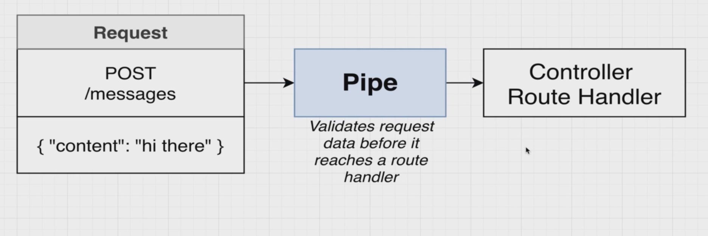
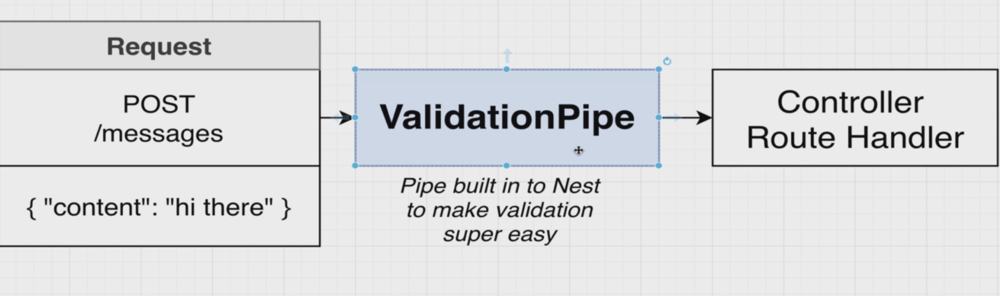

```ts
import { NestFactory } from '@nestjs/core';
import { MessagesModule } from './messages/messages.module';
import { ValidationPipe } from '@nestjs/common';
async function bootstrap(): Promise<void> {
  const app = await NestFactory.create(MessagesModule);
  app.useGlobalPipes(new ValidationPipe());
  await app.listen(3000);
}

```

## 18 - Adding Validation Rules
add the following packages to the project

```shell
npm i class-validator class-transformer
```

[class validator](https://www.npmjs.com/package/class-validator)
[class transformer](https://www.npmjs.com/package/class-transformer)


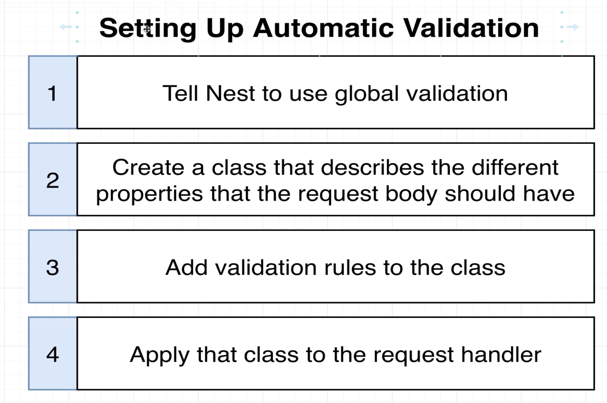
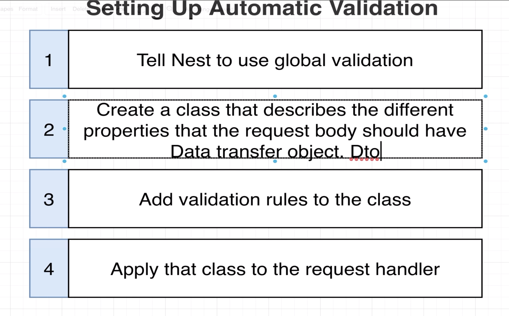
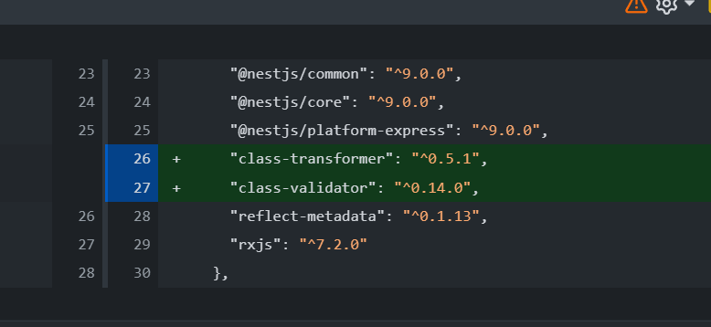

let's create the dto

```ts
import { IsString } from 'class-validator';
export class CreateMessageDto {
  @IsString()
  content: string;
}

```

let's use it in the controller

```ts
import { Body, Controller, Get, Param, Post } from '@nestjs/common';
import { CreateMessageDto } from './dtos/create-message.dto';
@Controller('messages')
export class MessagesController {
  }
  @Post()
  createMessage(@Body() body: CreateMessageDto) {
    console.log(body);
    return {
      id: 1,
```

let's test it 

4 - Validating Request Data with Pipes\request.http
```http request
{
  "content": "hello world"
}
### create a message invalid content
POST http://localhost:3000/messages
content-type: application/json
{
  "content": 123
}
```

## 19 - Behind the Scenes of Validation

class-transformer documentation [🔥 here](https://github.com/typestack/class-transformer#what-is-class-transformer)

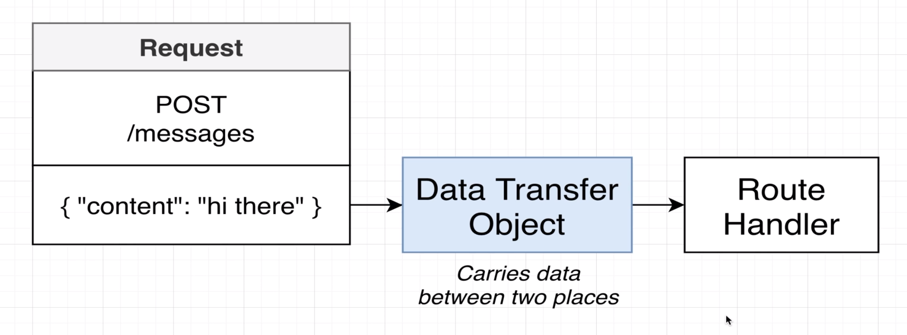
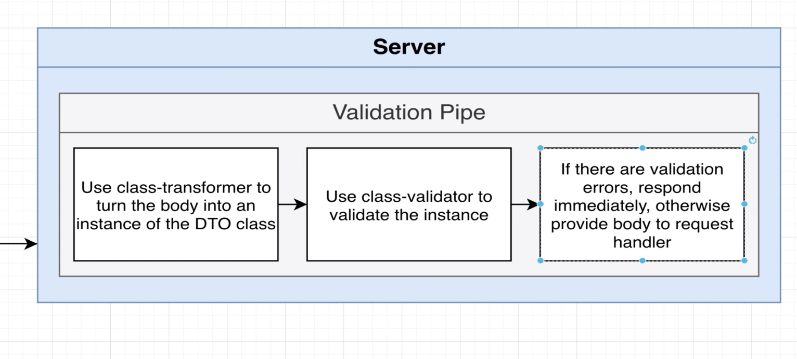
## 20 - How Type Info is Preserved
```js
// We can use the @Body() decorator to access the body of the request. The @Body()
// decorator will automatically deserialize the JSON body of the request into an
// instance of the CreateMessageDto class.

__decorate([
    (0, common_1.Post)(),
    __param(0, (0, common_1.Body)()),
    __metadata("design:type", Function),
    __metadata("design:paramtypes", [create_message_dto_1.CreateMessageDto]),
    __metadata("design:returntype", void 0)
], MessagesController.prototype, "createMessage", null);
```

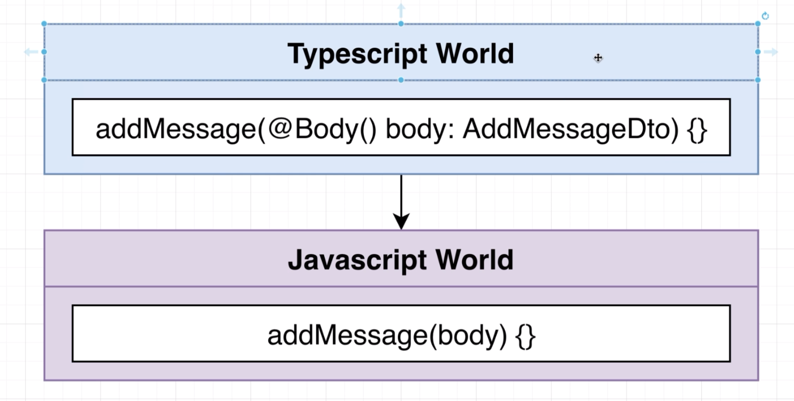

