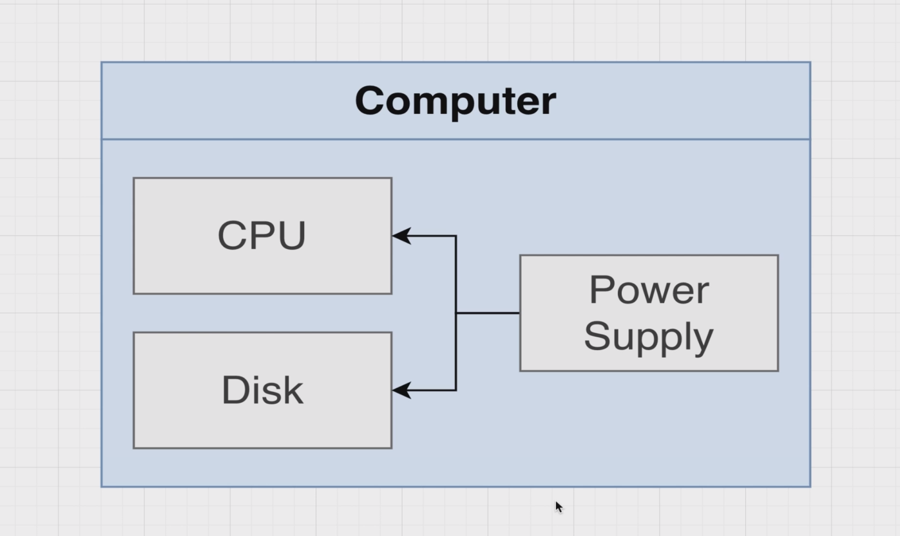
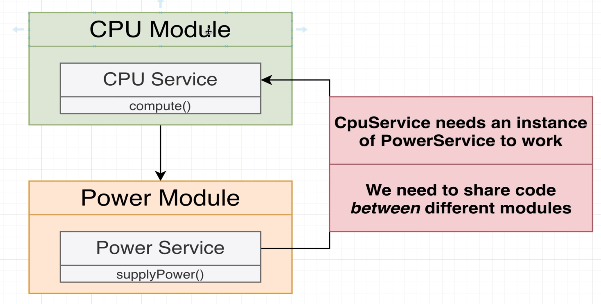
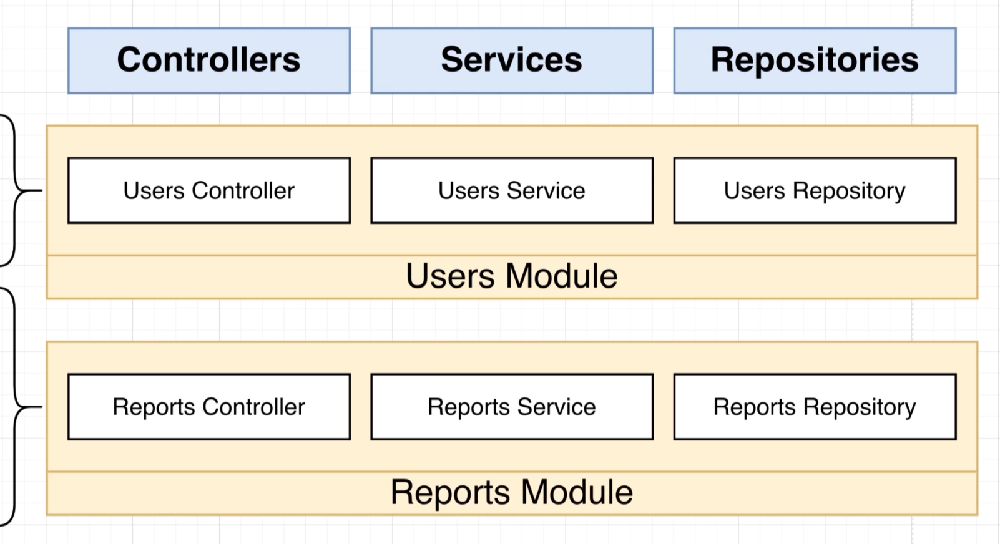
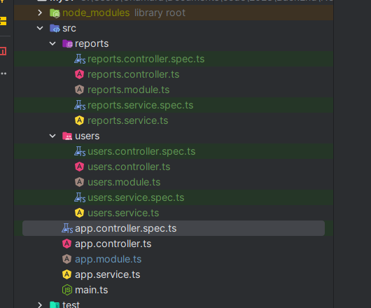
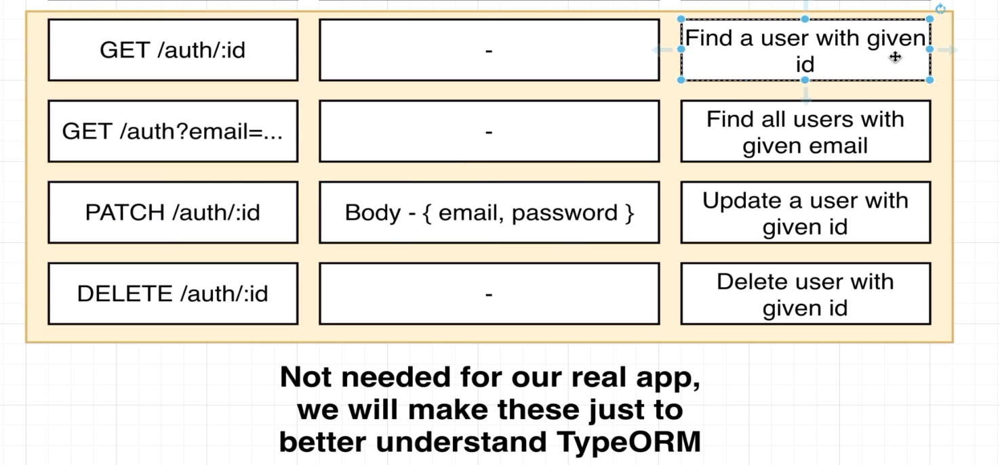
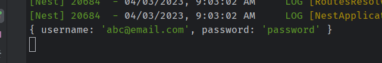

# Nest Architecture Organizing Code with Modules

## 31 - Project Overview





let's generate the project using nest cli

```shell
nest new di

```

## 32 - Generating a Few Files
## 33 - Setting Up DI Between Modules
## 34 - More on DI Between Modules
## 35 - Consuming Multiple Modules
## 36 - Modules Wrapup
















