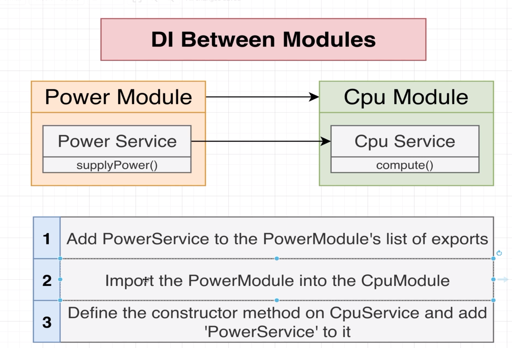
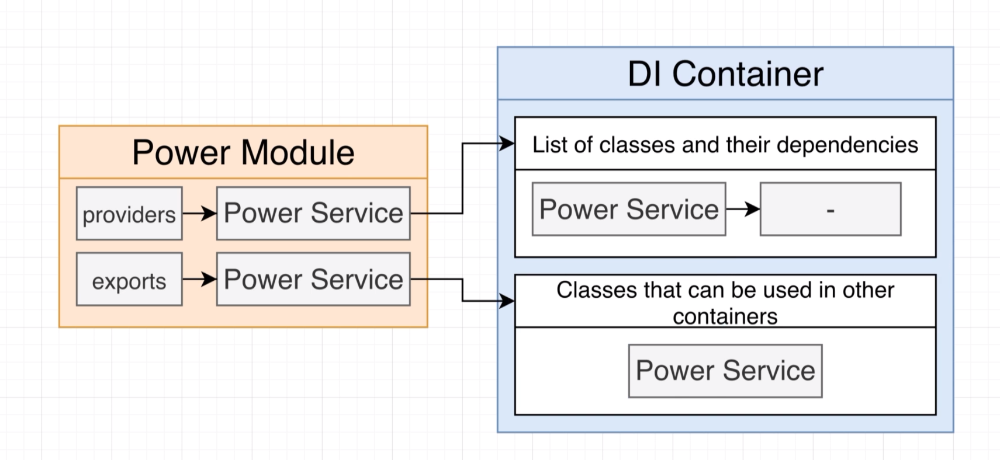
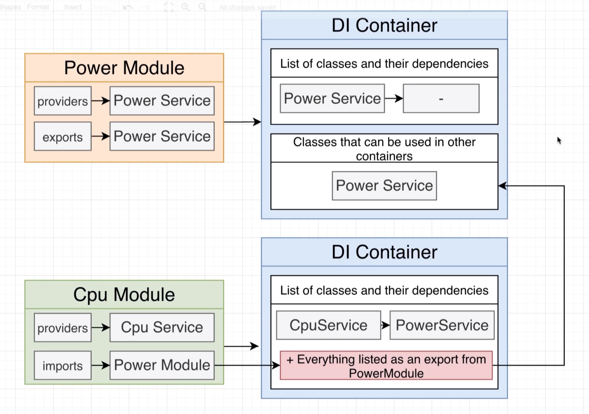

# Nest Architecture Organizing Code with Modules

## 31 - Project Overview


let's generate the project using nest cli

```shell
nest new di

```

## 32 - Generating a Few Files


```ts
import { Injectable } from '@nestjs/common';

@Injectable()
export class PowerService {
    supplyPower(watts:number) {
        console.log(`supplying ${watts} of power`)
    }
}
```

## 33 - Setting Up DI Between Modules




let's add powerService to the app module as a export

```ts
import { PowerService } from './power.service';
@Module({
  providers: [PowerService],
  exports: [PowerService],
})
export class PowerModule {}

```

let's import the power module in the cpu module
```ts
import { Module } from '@nestjs/common';
import { CpuService } from './cpu.service';
import {PowerModule} from "../power/power.module";
@Module({
  providers: [CpuService],
  imports:[PowerModule]
})
export class CpuModule {}
```

let's add the cpu PowerService to the cpu service
```ts
import { Injectable } from '@nestjs/common';
import {PowerService} from "../power/power.service";
@Injectable()
export class CpuService {
    constructor(private powerService: PowerService) {}
}
```
## 34 - More on DI Between Modules
```ts
import { Module } from '@nestjs/common';
import { DiskService } from './disk.service';
import {PowerModule} from "../power/power.module";
@Module({
  providers: [DiskService],
  imports:[PowerModule]
})
export class DiskModule {
}
```
```ts
import { Injectable } from '@nestjs/common';
import {PowerService} from "../power/power.service";
@Injectable()
export class DiskService {
    constructor(private powerService:PowerService) {
    }
    getData():string{
        console.log(`drawing 5 of power`);
        this.powerService.supplyPower(5);
        return 'data';
    }
}
```


## 35 - Consuming Multiple Modules

DiskModule
```ts
@Module({
  providers: [DiskService],
  imports:[PowerModule],
  exports:[DiskService]
})
export class DiskModule {
}
```

CpuModule
```ts
@Module({
  providers: [CpuService],
  imports:[PowerModule],
  exports:[CpuService]
})
export class CpuModule {}
```

ComputerModule
```ts
import { Module } from '@nestjs/common';
import { ComputerController } from './computer.controller';
import {CpuModule} from "../cpu/cpu.module";
import {DiskModule} from "../disk/disk.module";
@Module({
  controllers: [ComputerController],
  imports:[CpuModule,DiskModule]
})
export class ComputerModule {}
```

ComputerController
```ts
import { Controller, Get } from '@nestjs/common';
import { CpuService } from '../cpu/cpu.service';
import { DiskService } from '../disk/disk.service';
@Controller('computer')
export class ComputerController {
  constructor(
    private cpuService: CpuService,
    private diskService: DiskService,
  ) {}
  @Get()
  run() {
    return [this.diskService.getData(), this.cpuService.compute(12, 1)];
  }
}
```


```http

# getting messages
GET localhost:3000/computer

```
## 36 - Modules Wrapup





