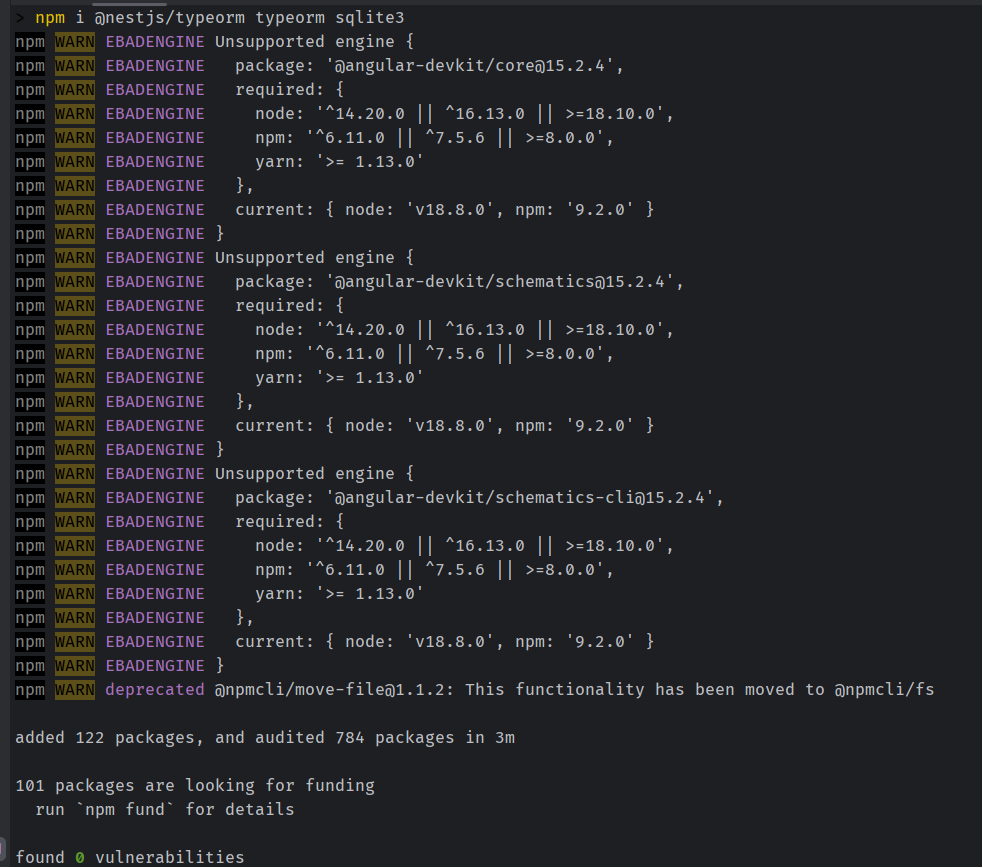
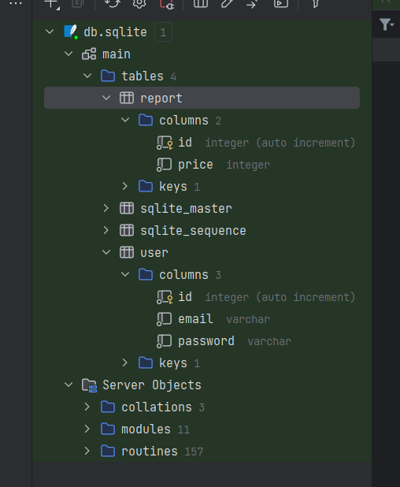
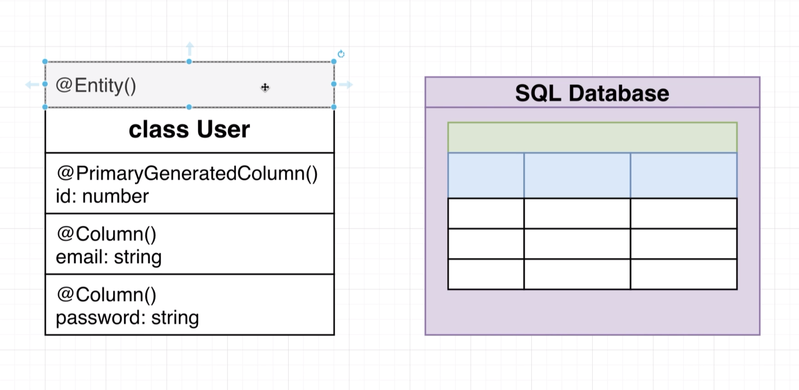
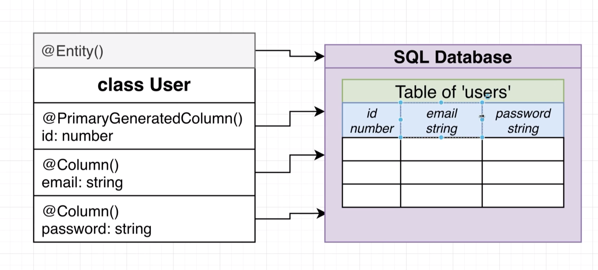
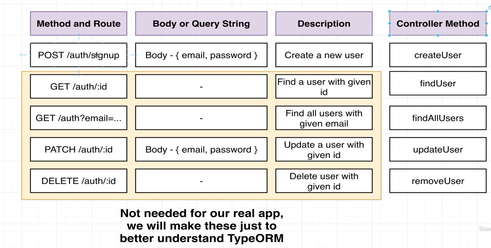
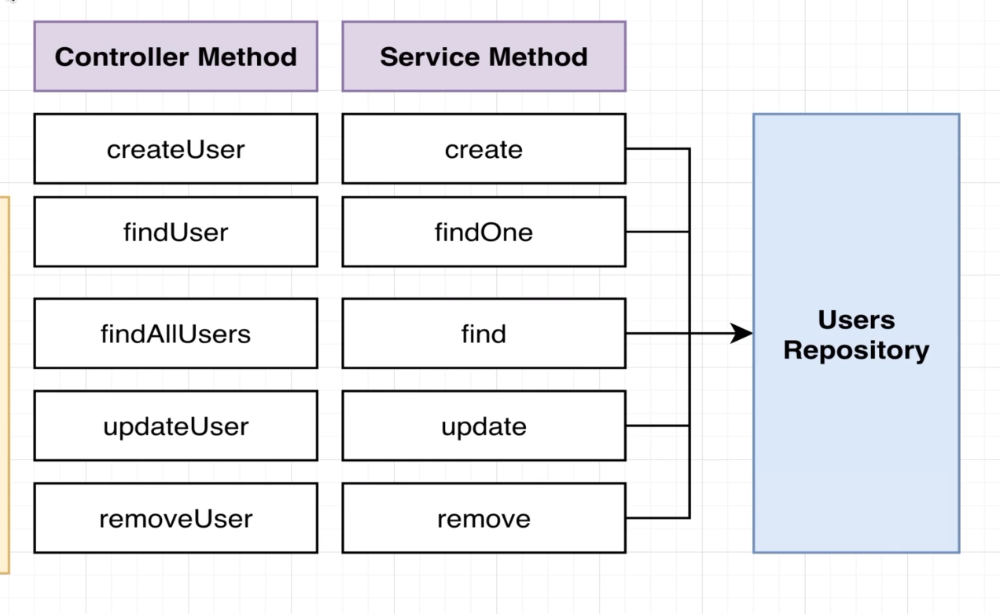

# 8 - Persisting Data with TypeORM

## 41 - Persistent Data with Nest


```shell
 npm i @nestjs/typeorm typeorm sqlite3 
```


## 42 - Setting Up a Database Connection





```ts
// app.module.ts
// Import the AppService
import { AppService } from './app.service';
// Import the UsersModule
import { UsersModule } from './users/users.module';
// Import the ReportsModule
import { ReportsModule } from './reports/reports.module';
// Import the TypeOrmModule
import { TypeOrmModule } from '@nestjs/typeorm';
// Create the AppModule
@Module({
  // Import the TypeOrmModule with the database configuration
  imports: [
    TypeOrmModule.forRoot({
      type: 'sqlite',
      database: 'db.sqlite',
      entities: [],
      synchronize: true,
    }),
    // Import the UsersModule
    UsersModule,
    // Import the ReportsModule
    ReportsModule,
  ],
  controllers: [AppController],
  providers: [AppService],
})
```
## 43 - Creating an Entity and Repository


user entity
```ts
import { Column, Entity, PrimaryGeneratedColumn } from 'typeorm';
// 1. Import the decorator functions from the typeorm library
@Entity()
export class User {
  // 2. Apply the @Entity decorator to the User class
  @PrimaryGeneratedColumn()
  id: number;
  // 3. Apply the @PrimaryGeneratedColumn decorator to the id property
  @Column()
  email: string;
  // 4. Apply the @Column decorator to the email property
  @Column()
  password: string;
  // 5. Apply the @Column decorator to the password property
}
```

user module
```ts
import { Column, Entity, PrimaryGeneratedColumn } from 'typeorm'; // import typeorm decorators

@Entity() // decorator to mark this class as the entity
export class User {
  @PrimaryGeneratedColumn() // decorator to mark this column as the primary key
  id: number;
  @Column() // decorator to mark this column as a column in the database
  email: string;
  @Column()
  password: string;
}
``` 

app module
```ts
import { UsersModule } from './users/users.module';
import { ReportsModule } from './reports/reports.module';
import { TypeOrmModule } from '@nestjs/typeorm';
import { User } from './users/user.entity';
@Module({
  imports: [
    // Import the TypeORM module
    TypeOrmModule.forRoot({
      // Specify the database type
      type: 'sqlite',
      // Specify the database file name
      database: 'db.sqlite',
      // Specify the entities to be loaded
      entities: [User],
      // Specify whether to synchronize the database schema with the entities
      synchronize: true,
    }),
    UsersModule,
```

## 44 - Viewing a DBs Contents
## 45 - Understanding TypeORM Decorators
## 46 - One Quick Note on Repositories
## 47 - A Few Extra Routes
## 48 - Setting Up Body Validation
## 49 - Manual Route Testing













