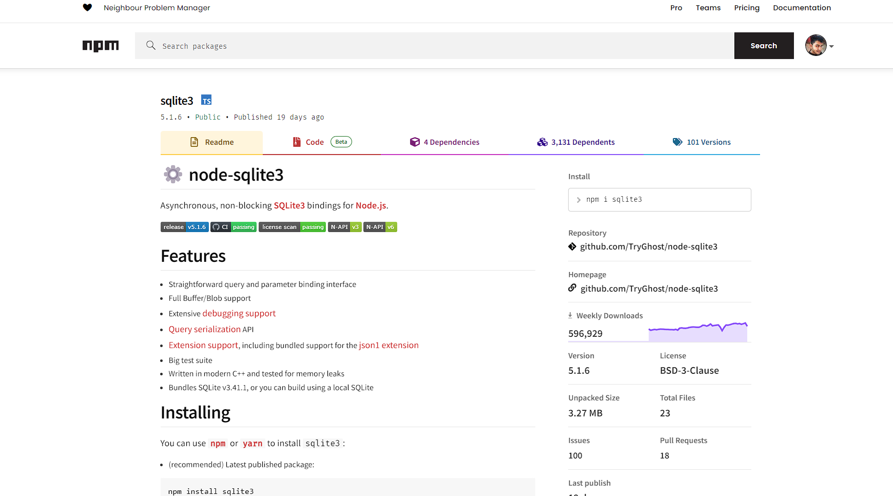
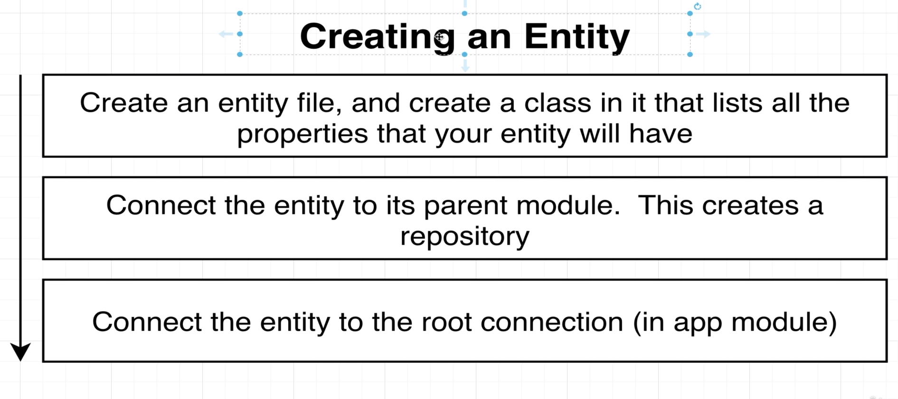
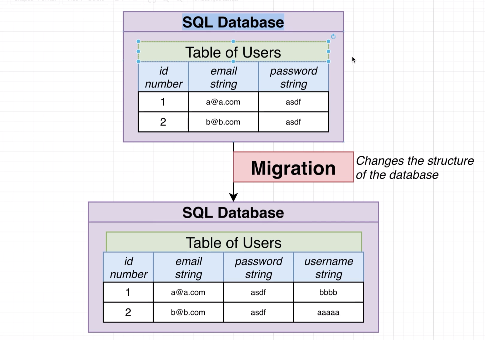
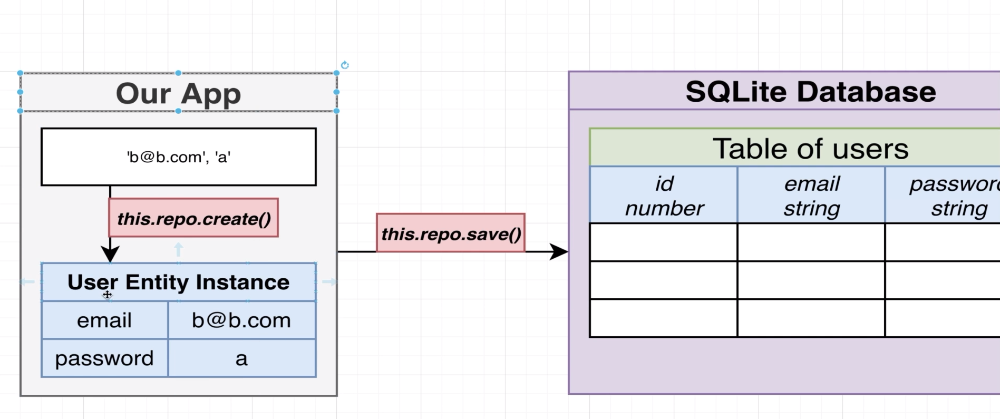
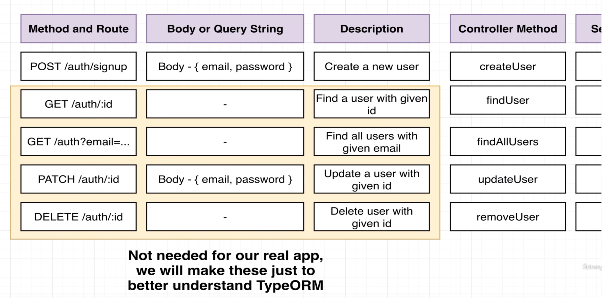

# 8 - Persisting Data with TypeORM

## 41 - Persistent Data with Nest


```shell
 npm i @nestjs/typeorm typeorm sqlite3 
```


## 42 - Setting Up a Database Connection



```ts
import { AppService } from './app.service';
import { UsersModule } from './users/users.module';
import { ReportsModule } from './reports/reports.module';
import { TypeOrmModule } from '@nestjs/typeorm';
@Module({
  imports: [
    TypeOrmModule.forRoot({
      type: 'sqlite',
      database: 'db.sqlite',
      entities: [],
      synchronize: true,
    }),
    UsersModule,
    ReportsModule,
  ],
  controllers: [AppController],
  providers: [AppService],
})
```
## 43 - Creating an Entity and Repository
## 44 - Viewing a DBs Contents
## 45 - Understanding TypeORM Decorators
## 46 - One Quick Note on Repositories
## 47 - A Few Extra Routes
## 48 - Setting Up Body Validation
## 49 - Manual Route Testing








