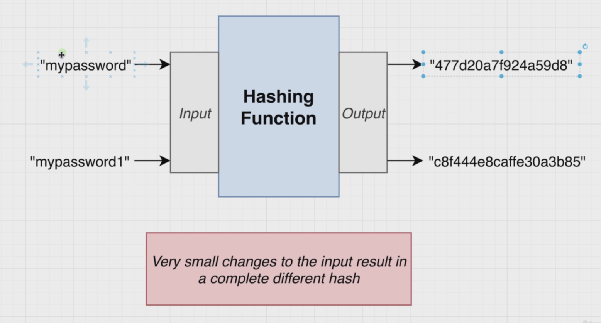
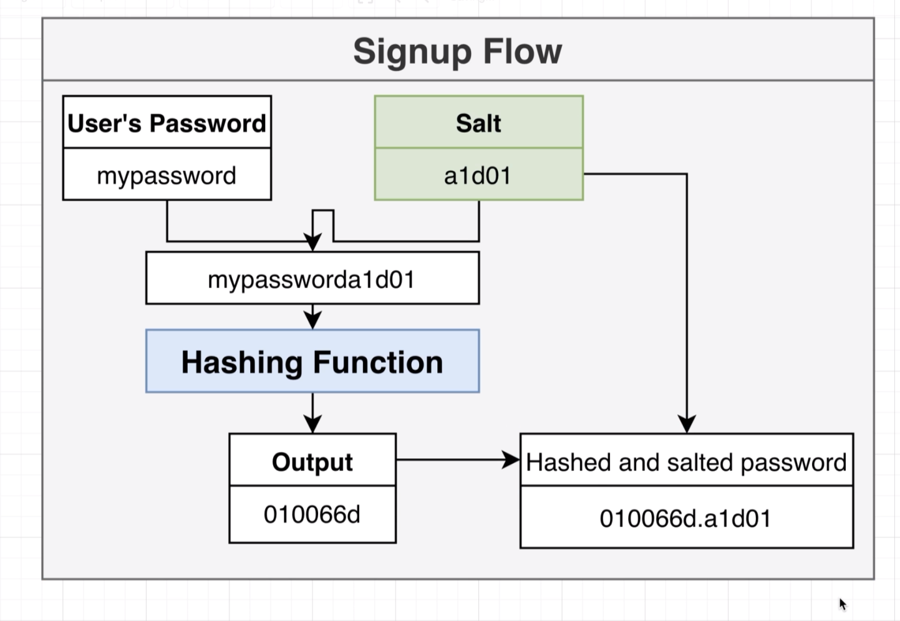
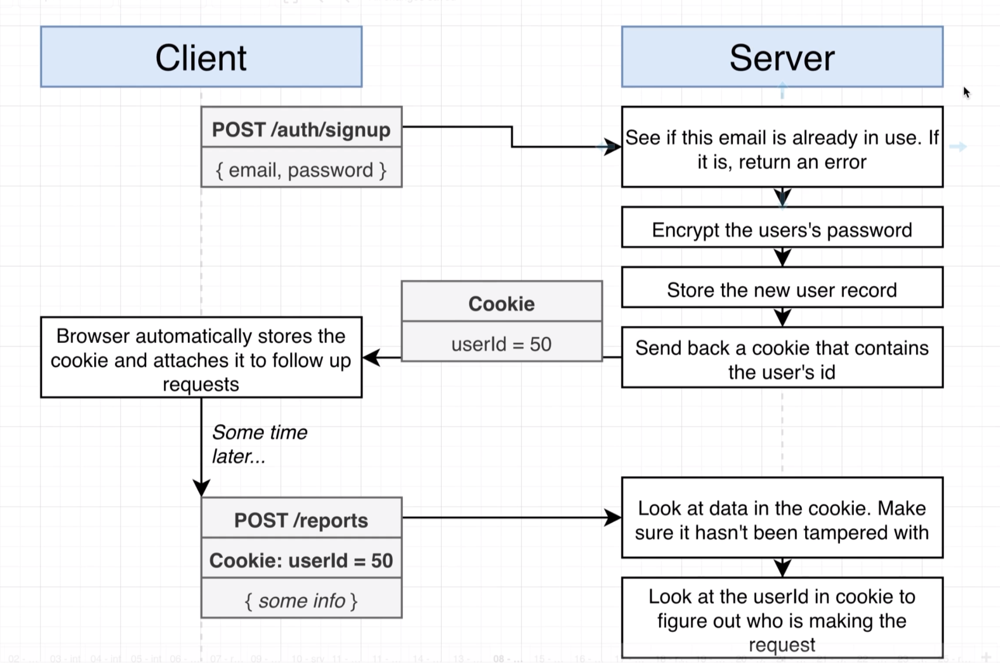
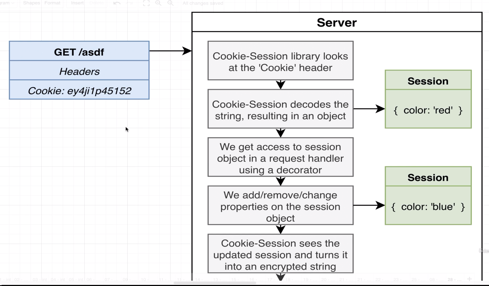
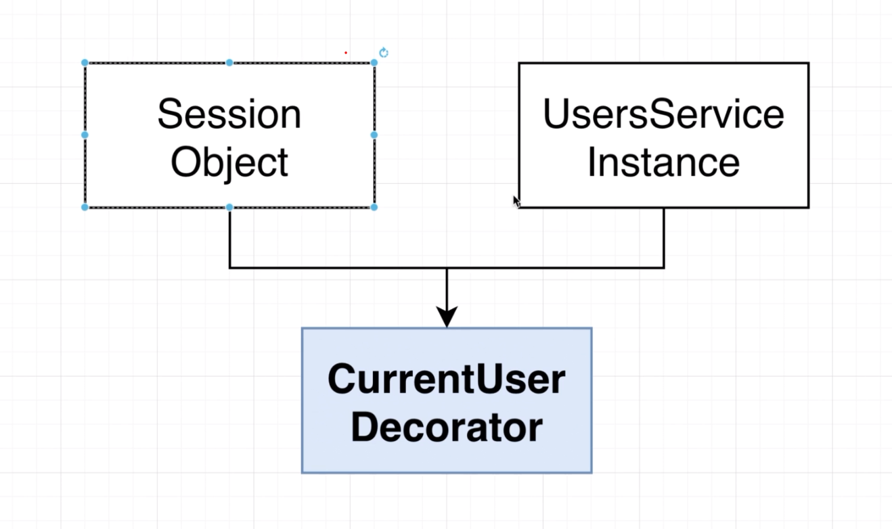
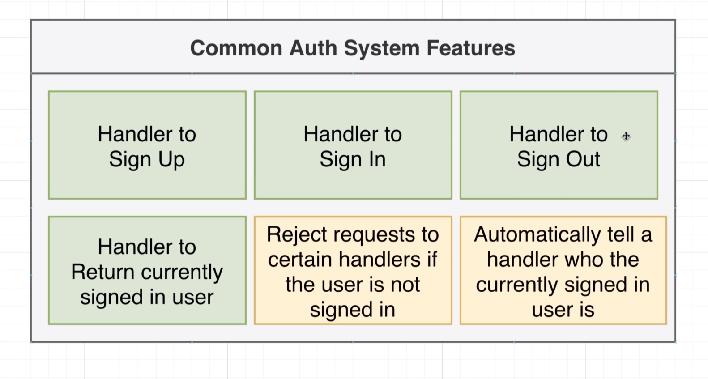
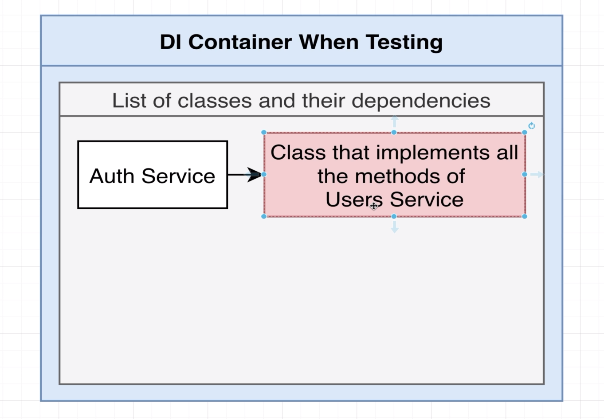
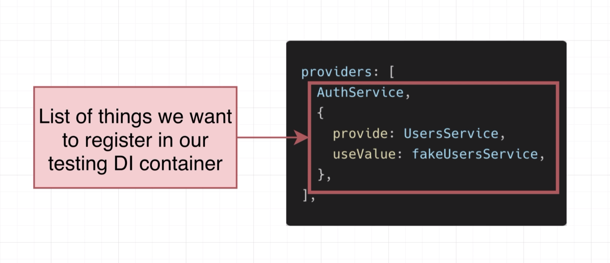
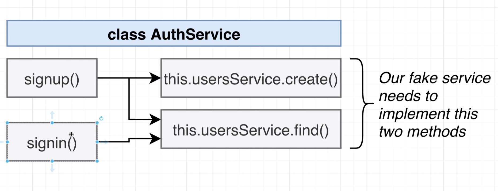
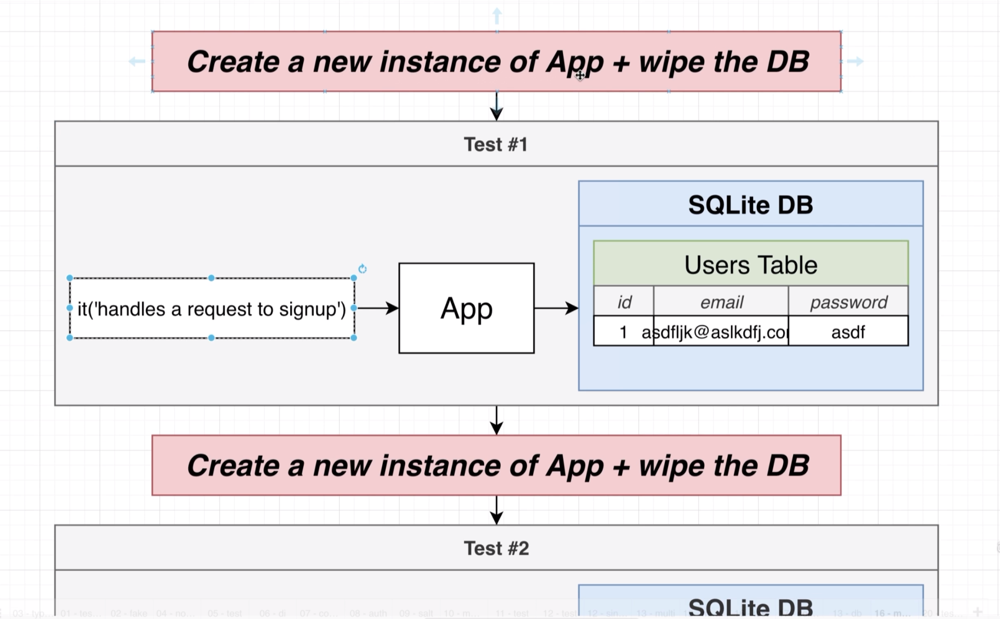

# Custom Data Serialization
## 61 - Excluding Response Properties 


## 62 - Solution to Serialization


## 63 - How to Build Interceptors


first undo the prevoius changes remove the exclude from the user entity
```ts
  Entity,
  PrimaryGeneratedColumn,
} from 'typeorm';
@Entity()
export class User {
  id: number;
  @Column()
  email: string;
  @Column()
  password: string;
```

let's build a custom interceptor to exclude the password from the response
```ts

import { CallHandler, ExecutionContext, NestInterceptor } from '@nestjs/common';
import { map, Observable } from 'rxjs';
export class SerializeInterceptors implements NestInterceptor {
  intercept(context: ExecutionContext, next: CallHandler): Observable<any> {
    // Run something before the request is handled by the request handler
    console.log('i am running before the handler', context);
    // Run something before a request is handled by the request handler
    return next.handle().pipe(
      map((data: any) => {
        // Run something before the response is sent out
        console.log('i am running before the response is sent out', data);
        return { data };
      }),
    );
  }
}
```
and use it in the user controller
```ts

import {
  Body,
  Controller,
  Delete,
  Get,
import { CreateUserDto } from './dtos/create-user.dto';
import { UsersService } from './users.service';
import { UpdateUserDto } from './dtos/update-user.dto';
import { SerializeInterceptors } from '../interceptors/serialize.interceptors';
@Controller('/auth')
export class UsersController {
    return this.usersService.create(email, password);
  }
  @UseInterceptors(SerializeInterceptors)
  @Get('/:id')
  findUser(@Param('id') id: string) {
    console.log('Fetching user...');
    return this.usersService.findOne(parseInt(id));
  }
```
```text
i am running before the handler ExecutionContextHost {
  args: [
    IncomingMessage {
      _readableState: [ReadableState],
      _events: [Object: null prototype] {},
      _eventsCount: 0,
      _maxListeners: undefined,
      socket: [Socket],
      httpVersionMajor: 1,
      httpVersionMinor: 1,
      httpVersion: '1.1',
      complete: false,
      rawHeaders: [Array],
      rawTrailers: [],
      aborted: false,
      upgrade: false,
      url: '/auth/9',
      method: 'GET',
      statusCode: null,
      statusMessage: null,
      client: [Socket],
      _consuming: false,
      _dumped: false,
      next: [Function: next],
      baseUrl: '',
      originalUrl: '/auth/9',
      _parsedUrl: [Url],
      params: [Object],
      query: {},
      res: [ServerResponse],
      body: {},
      route: [Route],
      [Symbol(kCapture)]: false,
      [Symbol(kHeaders)]: [Object],
      [Symbol(kHeadersCount)]: 8,
      [Symbol(kTrailers)]: null,
      [Symbol(kTrailersCount)]: 0
    },
    ServerResponse {
      _events: [Object: null prototype],
      _eventsCount: 1,
      _maxListeners: undefined,
      outputData: [],
      outputSize: 0,
      writable: true,
      destroyed: false,
      [Symbol(kCapture)]: false,
      [Symbol(kNeedDrain)]: false,
      [Symbol(corked)]: 0,
      [Symbol(kOutHeaders)]: [Object: null prototype],
      [Symbol(kUniqueHeaders)]: null
    },
    [Function: next]
  ],
  constructorRef: [class UsersController],
  handler: [Function: findUser],
  contextType: 'http'
}
Fetching user...
i am running before the response is sent out User { id: 9, email: 'chamara@gmail.com', password: '111111' }

```
## 64 - Serialization in the Interceptor
this is what we are going to do


let's create a dto for the user
```ts
import { Expose } from 'class-transformer';
export class UserDto {
  @Expose()
  id: number;
  @Expose()
  email: string;
}
```

let's add the dto to the interceptor
```ts
import { CallHandler, ExecutionContext, NestInterceptor } from '@nestjs/common';
import { map, Observable } from 'rxjs';
import { plainToInstance } from 'class-transformer';
import { UserDto } from '../users/dtos/user.dto';
export class SerializeInterceptors implements NestInterceptor {
  intercept(context: ExecutionContext, next: CallHandler): Observable<any> {
    // Run something before a request is handled by the request handler
    // The CallHandler is a function that we call to actually run the request handler
    return next.handle().pipe(
      map((data: any) => {
        // data here is the data we return from the controller
        // UserDto is the class we want to transform the data into
        return plainToInstance(UserDto, data, {
          excludeExtraneousValues: true,
        });
      }),
    );
  }
```

## 65 - Customizing the Interceptors DTO
let's customize the interceptor to accept the dto as a parameter
```ts
import { CallHandler, ExecutionContext, NestInterceptor } from '@nestjs/common';
import { map, Observable } from 'rxjs';
import { plainToInstance } from 'class-transformer';
export class SerializeInterceptors implements NestInterceptor {
  constructor(private dto: any) {}
  intercept(context: ExecutionContext, next: CallHandler): Observable<any> {
    return next.handle().pipe(
      map((data: any) => {
        return plainToInstance(this.dto, data, {
          excludeExtraneousValues: true,
        });
      }),
```

and use it in the user controller
```ts
import { UsersService } from './users.service';
import { UpdateUserDto } from './dtos/update-user.dto';
import { SerializeInterceptors } from '../interceptors/serialize.interceptors';
import { UserDto } from './dtos/user.dto';
@Controller('/auth')
export class UsersController {
    return this.usersService.create(email, password);
  }
  @UseInterceptors(new SerializeInterceptors(UserDto))
  @Get('/:id')
  findUser(@Param('id') id: string) {
    console.log('Fetching user...');
```
## 66 - Wrapping the Interceptor in a Decorator
let's create a decorator for the interceptor
```ts
import {
  CallHandler,
  ExecutionContext,
  NestInterceptor,
  UseInterceptors,
} from '@nestjs/common';
import { map, Observable } from 'rxjs';
import { plainToInstance } from 'class-transformer';
export function Serialize(dto: any) {
  return UseInterceptors(new SerializeInterceptors(dto));
}
export class SerializeInterceptors implements NestInterceptor {
  constructor(private dto: any) {}

```

and use it in the user controller
```ts
  Patch,
  Post,
  Query,
} from '@nestjs/common';
import { CreateUserDto } from './dtos/create-user.dto';
import { UsersService } from './users.service';
import { UpdateUserDto } from './dtos/update-user.dto';
import { Serialize } from '../interceptors/serialize.interceptors';
import { UserDto } from './dtos/user.dto';
@Controller('/auth')
    return this.usersService.create(email, password);
  }
  @Serialize(UserDto)
  @Get('/:id')
  findUser(@Param('id') id: string) {
    console.log('Fetching user...');
```
## 67 - ControllerWide Serialization
## 68 - A Bit of Type Safety Around Serialize






























