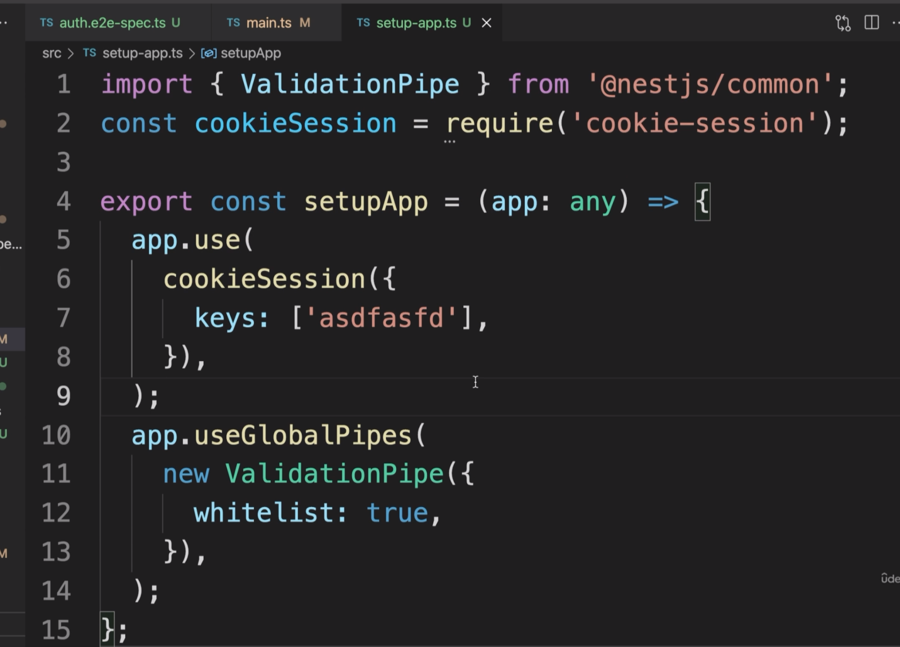
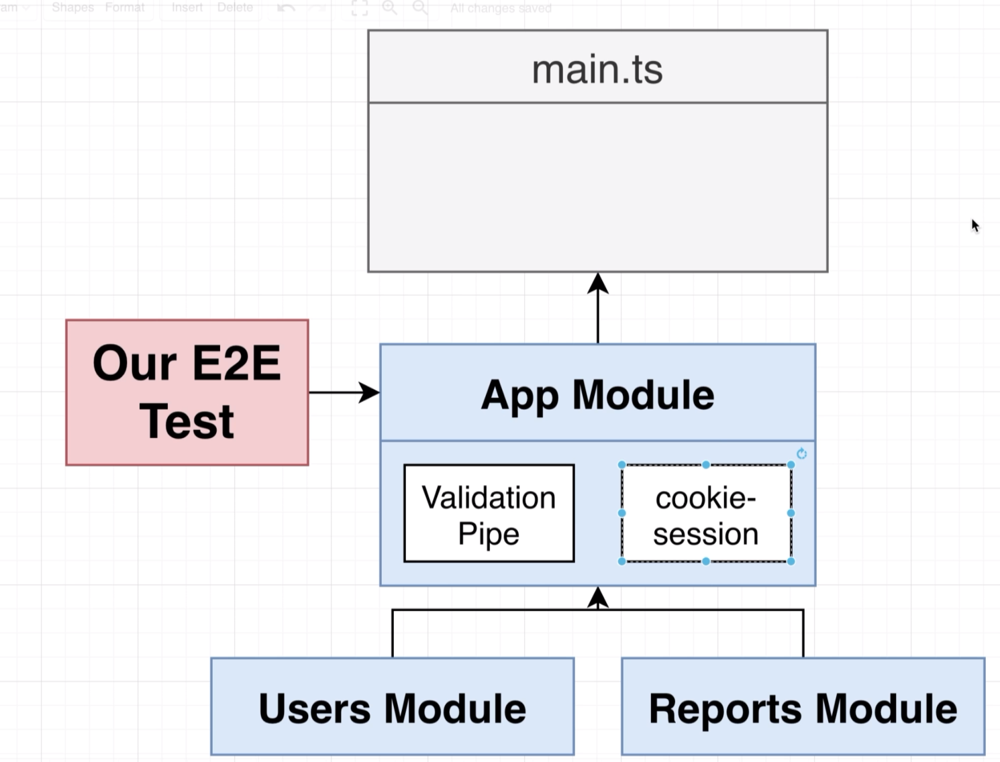
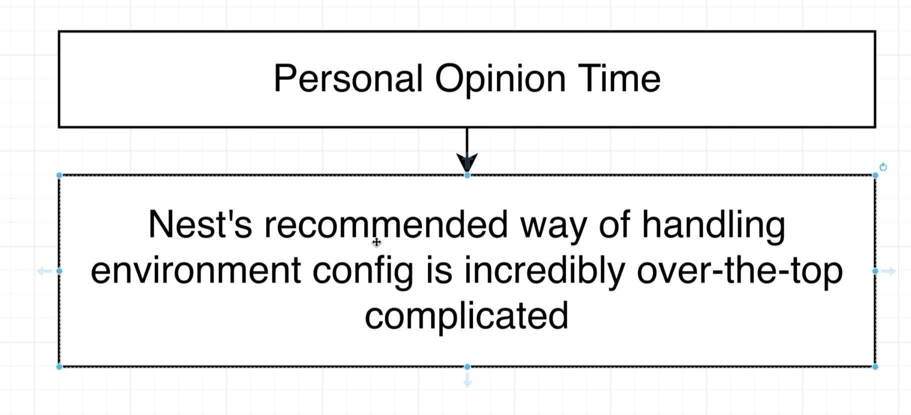
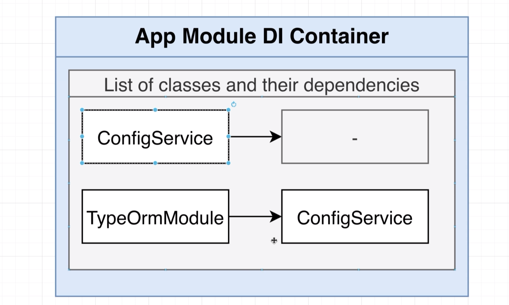
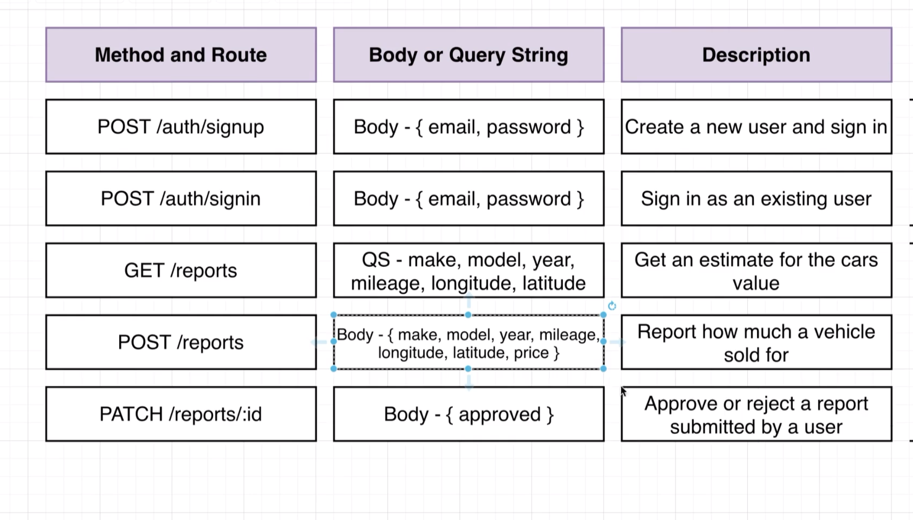

# Authentication From Scratch

## 69 - Authentication Overview 


## 70 - Reminder on Service Setup


let's create a auth service

```ts
import { Injectable } from '@nestjs/common';
import { UsersService } from './users.service';
@Injectable()
export class AuthService {
  constructor(private usersService: UsersService) {}
}
```

```ts
import { UsersService } from './users.service';
import { TypeOrmModule } from '@nestjs/typeorm';
import { User } from './user.entity';
import { AuthService } from './auth.service';
@Module({
    imports: [            // Import the TypeOrmModule and pass the User entity to it
        TypeOrmModule.forFeature([User])
    ],
    controllers: [UsersController],  // Add the UsersController to the list of controllers
    providers: [UsersService, AuthService]  // Add the UsersService and AuthService to the list of providers
})

```
## 71 - Implementing Signup Functionality
## 72 - Optional Understanding Password Hashing
## 73 - Salting and Hashing the Password
## 74 - Creating a User
## 75 - Handling User Sign In
## 76 - Setting up Sessions
## 77 - Changing and Fetching Session Data
## 78 - Signing in a User
## 79 - Getting the Current User
## 80 - Signing Out a User
## 81 - Two Automation Tools
## 82 - Custom Param Decorators
## 83 - Why a Decorator and Interceptor
## 84 - Communicating from Interceptor to Decorator
## 86 - Connecting an Interceptor to Dependency Injection
## 87 - Globally Scoped Interceptors
## 88 - Preventing Access with Authentication Guards

















