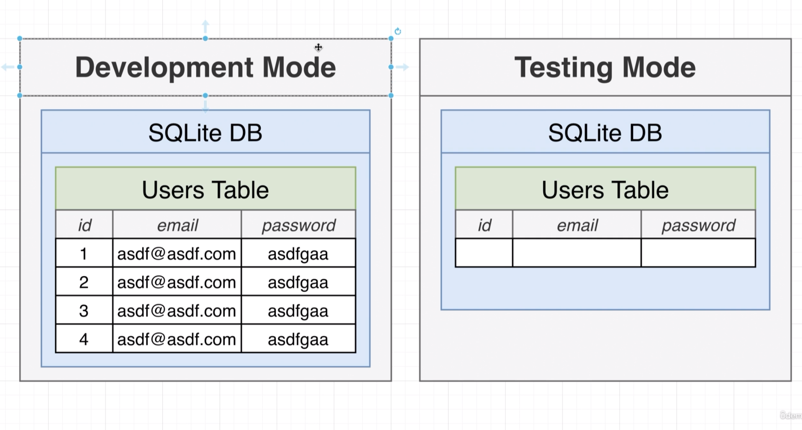
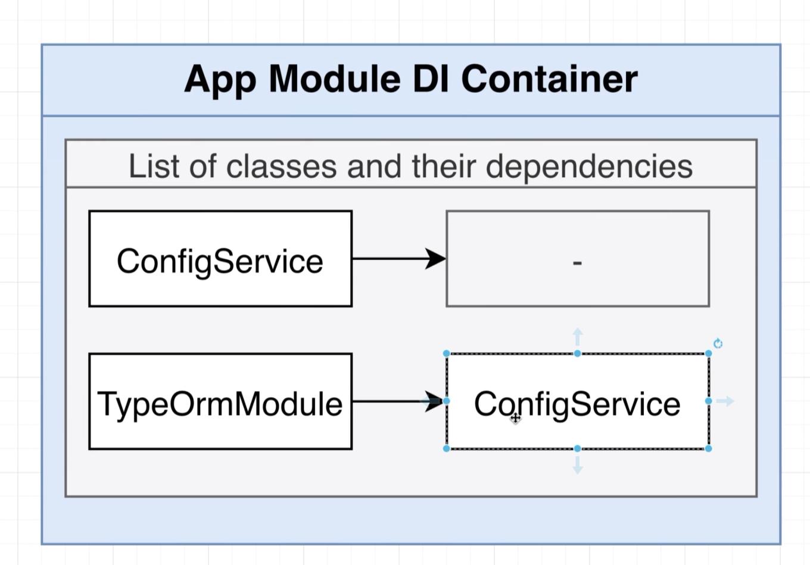

# Authentication From Scratch

## 69 - Authentication Overview 


## 70 - Reminder on Service Setup


let's create a auth service

```ts
import { Injectable } from '@nestjs/common';
import { UsersService } from './users.service';
@Injectable()
export class AuthService {
  constructor(private usersService: UsersService) {}
}
```

```ts
import { UsersService } from './users.service';
import { TypeOrmModule } from '@nestjs/typeorm';
import { User } from './user.entity';
import { AuthService } from './auth.service';
@Module({
    imports: [            // Import the TypeOrmModule and pass the User entity to it
        TypeOrmModule.forFeature([User])
    ],
    controllers: [UsersController],  // Add the UsersController to the list of controllers
    providers: [UsersService, AuthService]  // Add the UsersService and AuthService to the list of providers
})

```
## 71 - Implementing Signup Functionality
```ts
import { BadRequestException, Injectable } from '@nestjs/common';
import { UsersService } from './users.service';
@Injectable()
export class AuthService {
  constructor(private usersService: UsersService) {}
  async signUp(email: string, password: string) {
    //   see if the email in use
    const users = await this.usersService.find(email);
    if (users.length) {
      //   throw an error
      throw new BadRequestException('Email in use');
    }
    //   if not, hash their password
    //   create a new user and save them to the db
    //   return the user
  }
  signIn(email: string, password: string) {}
}
```
## 72 - Optional Understanding Password Hashing


## 73 - Salting and Hashing the Password
```ts
import { BadRequestException, Injectable } from '@nestjs/common';
import { UsersService } from './users.service';
import { randomBytes, scrypt as _scrypt } from 'crypto';
import { promisify } from 'util';
const scrypt = promisify(_scrypt);
@Injectable()
export class AuthService {
      throw new BadRequestException('Email in use');
    }
    //   if not, hash their password
    // generate a salt
    const salt = randomBytes(8).toString('hex');
    // hash the salt + the plain text password
    const hash = (await scrypt(password, salt, 32)) as Buffer;
    // join the salt and the hash together
    const result = salt + '.' + hash.toString('hex');
    //   create a new user and save them to the db
    //   return the user
  }
```
## 74 - Creating a User
```ts
const hash = (await scrypt(password, salt, 32)) as Buffer;
    // join the salt and the hash together
    const result = salt + '.' + hash.toString('hex');
    //   create a new user and save them to the db
    //   return the user
    return await this.usersService.create(email, result);
  }
```

let's use it in the controller

```ts
import { UpdateUserDto } from './dtos/update-user.dto';
import { Serialize } from '../interceptors/serialize.interceptors';
import { UserDto } from './dtos/user.dto';
import { AuthService } from './auth.service';
@Controller('/auth')
@Serialize(UserDto)
export class UsersController {
  constructor(
    private usersService: UsersService,
    private authService: AuthService,
  ) {}
  @Post('/signup')
  createUser(@Body() body: CreateUserDto) {
    const { email, password } = body;
    return this.authService.signUp(email, password);
  }
  @Get('/:id')
```

```http
### CREATE A NEW USER
POST localhost:3000/auth/signup
content-type: application/json
{
  "email": "chamara1@gmail.com",
  "password": "password"
}
```

data base is updated
```json
[
  {
    "id": 9,
    "email": "chamara@gmail.com",
    "password": "111111"
  },
  {
    "id": 10,
    "email": "abc@email.com",
    "password": "password"
  },
  {
    "id": 11,
    "email": "abc@email.com",
    "password": "password"
  },
  {
    "id": 12,
    "email": "chamara1@gmail.com",
    "password": "7fead9ba0a2d2e5c.64d509dbd65e3da3c2df9d5321338628d251a7832208332a42cc0a9f73b75ae4"
  },
  {
    "id": 13,
    "email": "chamara1a@gmail.com",
    "password": "e1dc864c68c1404a.4dffe7a4631d25932f4e56bb1b637a54d01cce94b42fdbecda75e975ba196da7"
  },
  {
    "id": 14,
    "email": "chamara1aqq@gmail.com",
    "password": "91dd936bcca07f56.42d3a348449cd90e3a6be75b6ee34e12f028557f1ade8541b5470d0c16c9d175"
  }
]
```
## 75 - Handling User Sign In


```ts
    return await this.usersService.create(email, result);
  }
  async signIn(email: string, password: string) {
    const [user] = await this.usersService.find(email);
    if (!user) {
      throw new BadRequestException('Invalid email');
    }
    const [salt, storedHash] = user.password.split('.');
    const hash = (await scrypt(password, salt, 32)) as Buffer;
    if (storedHash !== hash.toString('hex')) {
      throw new BadRequestException('Invalid password');
    }
    return user;
  }
}
```

```ts
    private authService: AuthService,
  ) {}
  @Post('/signin')
  signIn(@Body() body: CreateUserDto) {
    const { email, password } = body;
    return this.authService.signIn(email, password);
  }
  @Post('/signup')
  createUser(@Body() body: CreateUserDto) {
    const { email, password } = body;
```

test it

```http
### SIGNIN A USER
POST localhost:3000/auth/signin
content-type: application/json
{
  "email": "chamara1aqq@gmail.com",
  "password": "password"
}
```


## 76 - Setting up Sessions

let's install the session package
```bash
npm install cookie-session @types/cookie-session 
```

setup the session in the main.ts file

```ts
import { AppModule } from './app.module';
import { ValidationPipe } from '@nestjs/common';
// eslint-disable-next-line @typescript-eslint/no-var-requires
const cookieSession = require('cookie-session');
async function bootstrap() {
  const app = await NestFactory.create(AppModule);
  app.use(
    cookieSession({
      keys: ['asdfasdf'],
    }),
  );
  app.useGlobalPipes(
    new ValidationPipe({
      whitelist: true,
```


## 77 - Changing and Fetching Session Data
```ts
  @Get('/colors/:color')
  setColor(@Param('color') color: string, @Session() session: any) {
    session.color = color;
  }

  @Get('/colors')
  getColor(@Session() session: any) {
    return session.color;
  }

```

we can test it

```http
### SET A COLOR
GET localhost:3000/auth/colors/blue

### GET A COLOR
GET localhost:3000/auth/colors
```

## 78 - Signing in a User


let's set the cookie session in the user controller
```ts

  Patch,
  Post,
  Query,
  Session,
} from '@nestjs/common';
import { CreateUserDto } from './dtos/create-user.dto';
import { UsersService } from './users.service';
  ) {}
  @Post('/signin')
  async signIn(@Body() body: CreateUserDto, @Session() session: any) {
    const { email, password } = body;
    const user = await this.authService.signIn(email, password);
    session.userId = user.id;
    return user;
  }
  @Post('/signup')
  async createUser(@Body() body: CreateUserDto, @Session() session: any) {
    const { email, password } = body;
    const user = await this.authService.signUp(email, password);
    session.userId = user.id;
    return user;
  }
  @Get('/:id')
```

let's test it

```http
### SIGN IN AS A NEW USER
POST localhost:3000/auth/signup
content-type: application/json
  "password": "password"
}
### SIGN UP AS A EXSISTING USER
POST localhost:3000/auth/signin
content-type: application/json
{
  "email": "chamara1aqq@gmail.com",
  "password": "password"
}
### FIND A USER
GET localhost:3000/auth/9
```
## 79 - Getting the Current User
let's add a route to get the current user
```ts
    private authService: AuthService,
  ) {}
  @Get('/whoami')
  async getMe(@Session() session: any) {
    if (!session.userId) {
      return null;
    }
    return this.usersService.findOne(session.userId);
  }
  @Post('/signin')
  async signIn(@Body() body: CreateUserDto, @Session() session: any) {
    const { email, password } = body;
```

and test it

```http
### GET CURRENT USER
GET localhost:3000/auth/whoami
```
## 80 - Signing Out a User
return null if the id is not defined
```ts

  async findOne(id: number) {
    if (!id) {
      return null;
    }
    const user = await this.usersRepository.findOne({
      where: { id },
    });
```

implement the sign out
```ts
  Controller,
  Delete,
  Get,
  NotFoundException,
  Param,
  Patch,
  Post,
  @Get('/whoami')
  async getMe(@Session() session: any) {
    if (!session.userId) {
      throw new NotFoundException('Not Authenticated');
    }
    return this.usersService.findOne(session.userId);
  }
    return user;
  }
  @Post('/signout')
  async signOut(@Session() session: any) {
    session.userId = null;
  }
  @Get('/:id')
  findUser(@Param('id') id: string) {
    return this.usersService.findOne(parseInt(id));
```

test it

```http
  Controller,
  Delete,
  Get,
  NotFoundException,
  Param,
  Patch,
  Post,
  @Get('/whoami')
  async getMe(@Session() session: any) {
    if (!session.userId) {
      throw new NotFoundException('Not Authenticated');
    }
    return this.usersService.findOne(session.userId);
  }
    return user;
  }
  @Post('/signout')
  async signOut(@Session() session: any) {
    session.userId = null;
  }
  @Get('/:id')
  findUser(@Param('id') id: string) {
    return this.usersService.findOne(parseInt(id));
```
## 81 - Two Automation Tools


## 82 - Custom Param Decorators

let's create a new decorator to get the current user
```ts
import { createParamDecorator, ExecutionContext } from '@nestjs/common';
export const CurrentUser = createParamDecorator(
  (data: any, context: ExecutionContext) => {
    return 'Hello World';
  },
);
```

do a small change to the controller
```ts
  import { Serialize } from '../interceptors/serialize.interceptors';
import { UserDto } from './dtos/user.dto';
import { AuthService } from './auth.service';
import { CurrentUser } from './decorators/current-user.decorator';
@Controller('/auth')
@Serialize(UserDto)
    private authService: AuthService,
  ) {}
  // @Get('/whoami')
  // async getMe(@Session() session: any) {
  //   if (!session.userId) {
  //     throw new NotFoundException('Not Authenticated');
  //   }
  //   return this.usersService.findOne(session.userId);
  // }
  @Get('/whoami')
  async getMe(@CurrentUser() user: string) {
    return user;
  }

```
## 83 - Why a Decorator and Interceptor


update the user decorator
```ts

import { createParamDecorator, ExecutionContext } from '@nestjs/common';
export const CurrentUser = createParamDecorator(
  (data: never, context: ExecutionContext) => {
    const request = context.switchToHttp().getRequest();
    console.log(request.session.userId);
  },
);
```

## 84 - Communicating from Interceptor to Decorator

let's add the current user interceptor
```ts
import {
  CallHandler,
  ExecutionContext,
  Injectable,
  NestInterceptor,
} from '@nestjs/common';
import { UsersService } from '../users.service';
@Injectable()
export class CurrentUserInterceptor implements NestInterceptor {
  constructor(private userService: UsersService) {}
  async intercept(context: ExecutionContext, next: CallHandler) {
    const request = context.switchToHttp().getRequest();
    const { userId } = request.session;
    if (userId) {
      request.currentUser = await this.userService.findOne(userId);
    }
    return next.handle();
  }
}
```
## 86 - Connecting an Interceptor to Dependency Injection
let's import the interceptor
```ts
import { TypeOrmModule } from '@nestjs/typeorm';
import { User } from './user.entity';
import { AuthService } from './auth.service';
import { CurrentUserInterceptor } from './interceptors/current-user.interceptor';
@Module({
  imports: [TypeOrmModule.forFeature([User])],
  controllers: [UsersController],
  providers: [UsersService, AuthService, CurrentUserInterceptor],
})
export class UsersModule {}
```

add it to the controller
```ts
  Post,
  Query,
  Session,
  UseInterceptors,
} from '@nestjs/common';
import { CreateUserDto } from './dtos/create-user.dto';
import { UsersService } from './users.service';
import { UserDto } from './dtos/user.dto';
import { AuthService } from './auth.service';
import { CurrentUser } from './decorators/current-user.decorator';
import { CurrentUserInterceptor } from './interceptors/current-user.interceptor';
import { User } from './user.entity';
@Controller('/auth')
@Serialize(UserDto)
@UseInterceptors(CurrentUserInterceptor)
export class UsersController {
  constructor(
    private usersService: UsersService,
  // }
  @Get('/whoami')
  async getMe(@CurrentUser() user: User) {
    return user;
  }
```

return the use from the decorator
```ts
export const CurrentUser = createParamDecorator(
  (data: never, context: ExecutionContext) => {
    const request = context.switchToHttp().getRequest();
    return request.currentUser;
  },
);
```
## 87 - Globally Scoped Interceptors


let's remove the interceptor from the controller
```ts

  Post,
  Query,
  Session,
} from '@nestjs/common';
import { CreateUserDto } from './dtos/create-user.dto';
import { UsersService } from './users.service';
import { UserDto } from './dtos/user.dto';
import { AuthService } from './auth.service';
import { CurrentUser } from './decorators/current-user.decorator';
import { User } from './user.entity';
@Controller('/auth')
@Serialize(UserDto)
export class UsersController {
  constructor(
    private usersService: UsersService,
```

and add it to the module
```ts
import { TypeOrmModule } from '@nestjs/typeorm';
import { User } from './user.entity';
import { AuthService } from './auth.service';
import { APP_INTERCEPTOR } from '@nestjs/core';
import { CurrentUserInterceptor } from './interceptors/current-user.interceptor';
@Module({
  imports: [TypeOrmModule.forFeature([User])],
  controllers: [UsersController],
  providers: [
    UsersService,
    AuthService,
    {
      provide: APP_INTERCEPTOR,
      useClass: CurrentUserInterceptor,
    },
  ],
})
export class UsersModule {}
```
## 88 - Preventing Access with Authentication Guards








