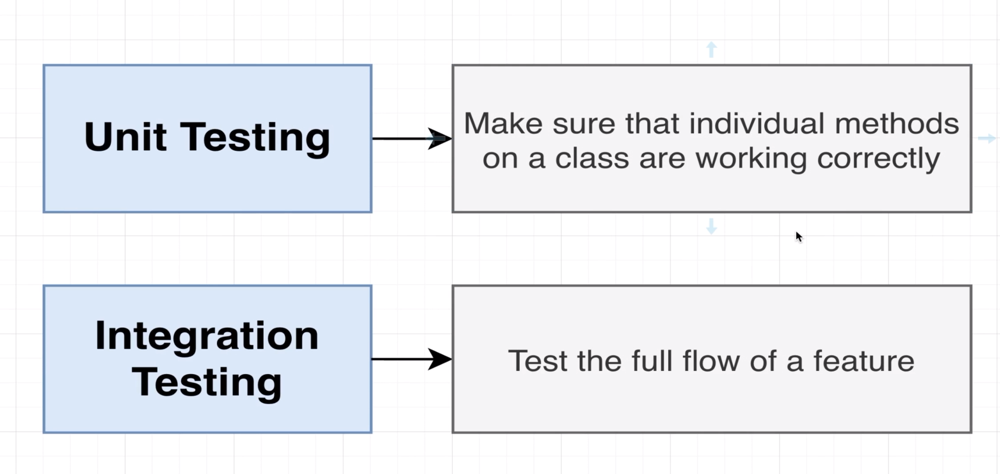
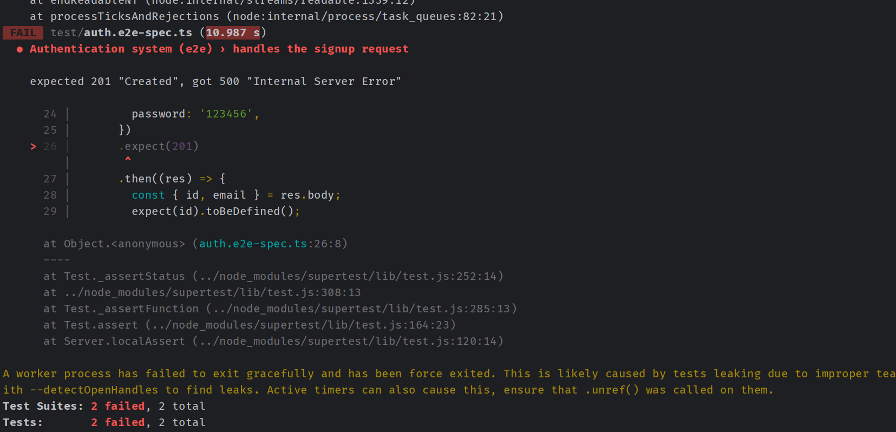
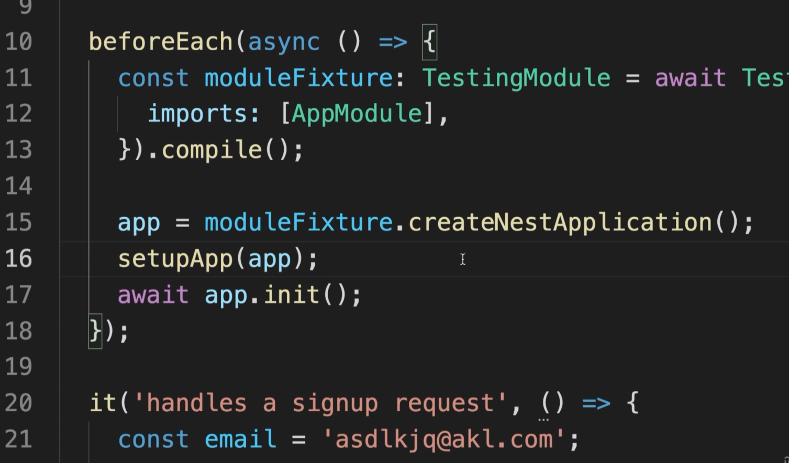
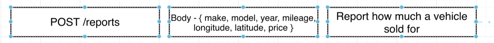

# Getting Started with Unit Testing 
## 89 - Testing Overview




## 90 - Testing Setup


```ts
import { AuthService } from './auth.service';
import { Test } from '@nestjs/testing';
import { UsersService } from './users.service';

it('can create an instance of auth service', async () => {
  const fakeUserService = {
    find: () => Promise.resolve([]),
    create: (email: string, password: string) =>
      Promise.resolve({ id: 1, email, password }),
  };

  const module = await Test.createTestingModule({
    providers: [
      AuthService,
      {
        provide: UsersService,
        useValue: fakeUserService,
      },
    ],
  }).compile();

  const service = module.get<AuthService>(AuthService);

  expect(service).toBeDefined();
});
```
## 91 - Yes Testing is Confusing


## 92 - Getting TypeScript to Help With Mocks


let's add some types to our fakeUserService
```ts
import { AuthService } from './auth.service';
import { Test } from '@nestjs/testing';
import { UsersService } from './users.service';
import { User } from './user.entity';

it('can create an instance of auth service', async () => {
  const fakeUserService: Partial<UsersService> = {
    find: () => Promise.resolve([]),
    create: (email: string, password: string) =>
      Promise.resolve({ id: 1, email, password } as User),
  };

  const module = await Test.createTestingModule({
    providers: [
      AuthService,
      {
        provide: UsersService,
        useValue: fakeUserService,
      },
    ],
  }).compile();

  const service = module.get<AuthService>(AuthService);

  expect(service).toBeDefined();
});

```
## 94 - Improving File Layout
## 95 - Ensuring Password Gets Hashed
## 97 - Changing Mock Implementations
## 99 - Testing the Signin Flow
## 101 - Checking Password Comparison
## 102 - More Intelligent Mocks
## 104 - Refactoring to Use Intelligent Mocks
## 105 - Unit Testing a Controller
## 106 - More Mock Implementations
## 108 - Not Super Effective Tests
## 109 - Testing the Signin Method










