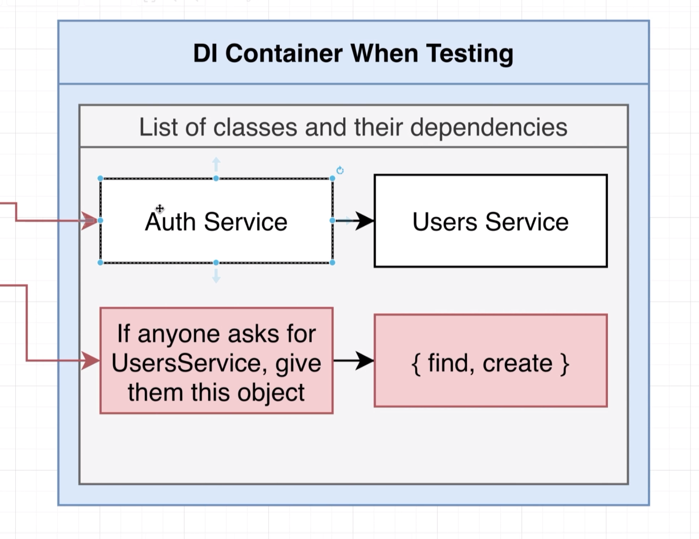
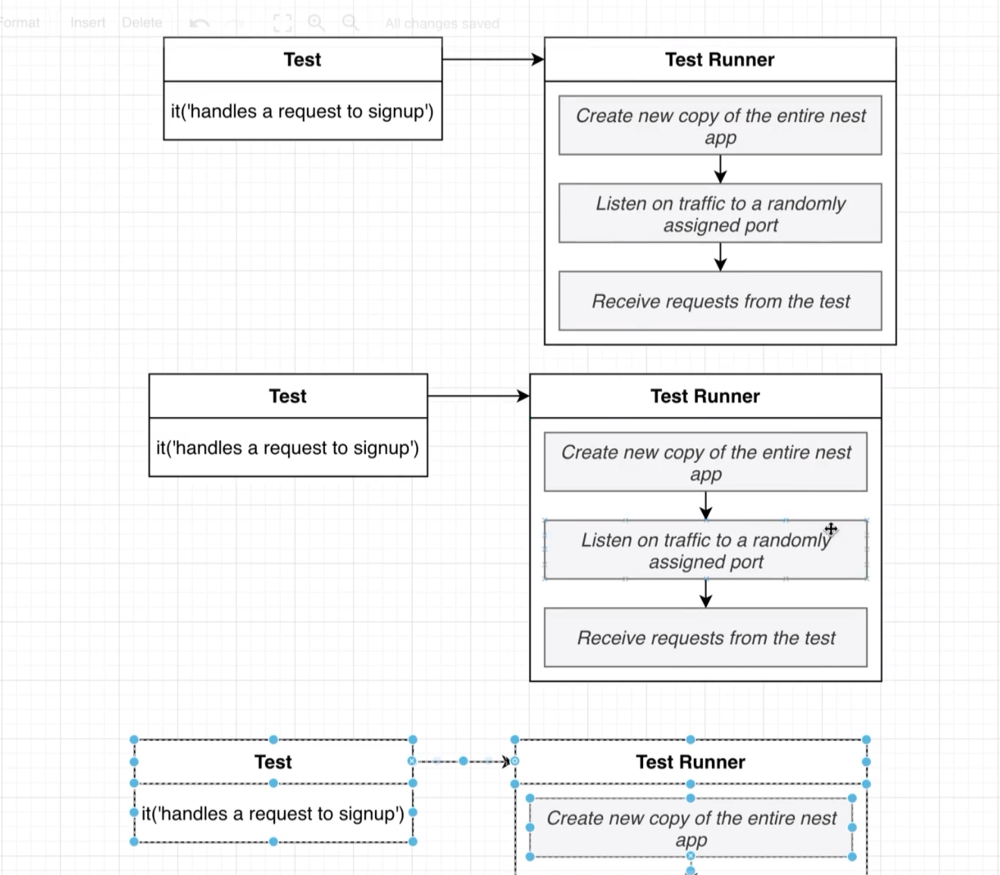
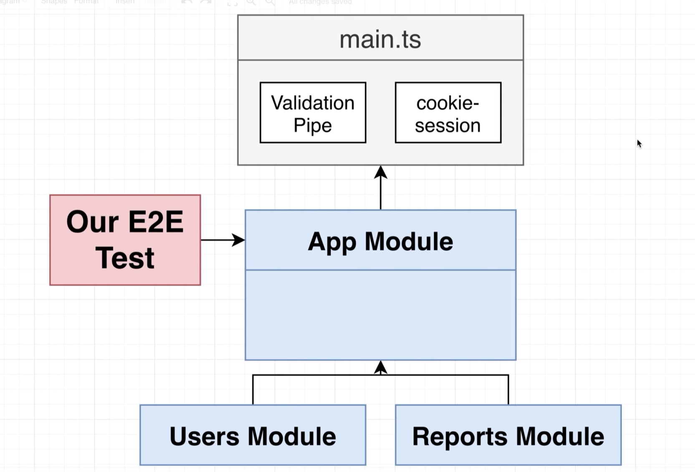
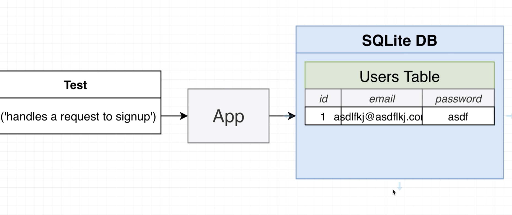
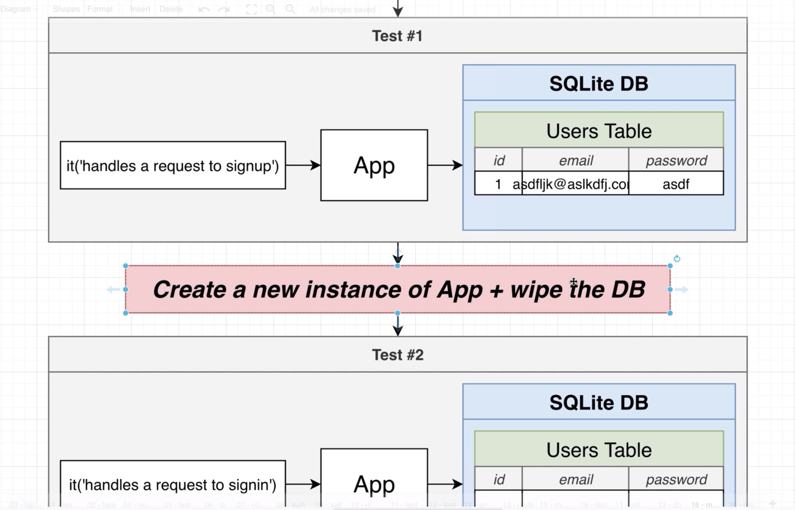
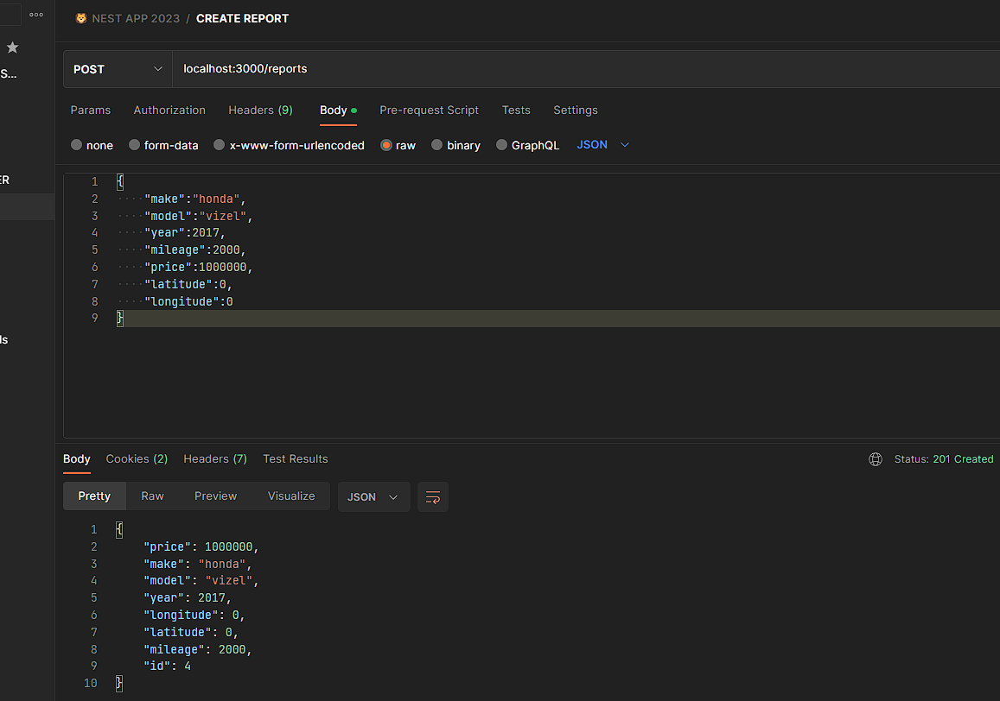

# Getting Started with Unit Testing 
## 89 - Testing Overview


## 90 - Testing Setup


```ts
import { AuthService } from './auth.service';
import { Test } from '@nestjs/testing';
import { UsersService } from './users.service';

it('can create an instance of auth service', async () => {
  const fakeUserService = {
    find: () => Promise.resolve([]),
    create: (email: string, password: string) =>
      Promise.resolve({ id: 1, email, password }),
  };

  const module = await Test.createTestingModule({
    providers: [
      AuthService,
      {
        provide: UsersService,
        useValue: fakeUserService,
      },
    ],
  }).compile();

  const service = module.get<AuthService>(AuthService);

  expect(service).toBeDefined();
});
```
## 91 - Yes Testing is Confusing




## 92 - Getting TypeScript to Help With Mocks


let's add some types to our fakeUserService
```ts
import { AuthService } from './auth.service';
import { Test } from '@nestjs/testing';
import { UsersService } from './users.service';
import { User } from './user.entity';

it('can create an instance of auth service', async () => {
  const fakeUserService: Partial<UsersService> = {
    find: () => Promise.resolve([]),
    create: (email: string, password: string) =>
      Promise.resolve({ id: 1, email, password } as User),
  };

  const module = await Test.createTestingModule({
    providers: [
      AuthService,
      {
        provide: UsersService,
        useValue: fakeUserService,
      },
    ],
  }).compile();

  const service = module.get<AuthService>(AuthService);

  expect(service).toBeDefined();
});

```
## 94 - Improving File Layout
let's refactor our test file to be more organized
```ts
import { AuthService } from './auth.service';
import { Test } from '@nestjs/testing';
import { UsersService } from './users.service';
import { User } from './user.entity';

describe('AuthService', () => {
  let service: AuthService;
  beforeEach(async () => {
    const fakeUserService: Partial<UsersService> = {
      find: () => Promise.resolve([]),
      create: (email: string, password: string) =>
        Promise.resolve({ id: 1, email, password } as User),
    };

    const module = await Test.createTestingModule({
      providers: [
        AuthService,
        {
          provide: UsersService,
          useValue: fakeUserService,
        },
      ],
    }).compile();

    service = module.get<AuthService>(AuthService);
  });

  it('can create an instance of auth service', async () => {
    expect(service).toBeDefined();
  });
});

```
## 95 - Ensuring Password Gets Hashed
```ts
  it('can create an instance of auth service', async () => {
    expect(service).toBeDefined();
  });
  it('creates a new user with a salted and hashed password', async () => {
    const user = await service.signUp('asdasd@gmail.com', 'asdasd');
    expect(user.password).not.toEqual('asdasd');
    const [salt, hash] = user.password.split('.');
    expect(salt).toBeDefined();
    expect(hash).toBeDefined();
  });
});
```
## 97 - Changing Mock Implementations
```ts
  it('throws an error if user signs up with email that is in use', async () => {
    fakeUserService.find = () =>
      Promise.resolve([
        { id: 1, email: 'abc@gmail.com', password: 'abc' } as User,
      ]);

    try {
      await service.signUp('abc@gmail.com', 'abc');
    } catch (e) {
      expect(e.message).toEqual('Email in use');
    }
  });
```
## 99 - Testing the Signin Flow
```ts
  describe('signin', () => {
    it('throws if an invalid email is provided', async () => {
      try {
        await service.signIn('abc', 'abc');
      } catch (e) {
        expect(e.message).toEqual('Invalid email');
      }
    });
  });
```
## 101 - Checking Password Comparison
```ts

    it('throws if an invalid password is provided', async () => {
      fakeUserService.find = () => {
        return Promise.resolve([
          {
            id: 1,
            email: 's',
            password: 'abc',
          } as User,
        ]);
      };

      try {
        await service.signIn('chamara1aqqq@gmail.com', 'password');
      } catch (e) {
        expect(e.message).toEqual('Invalid password');
      }
    });
    it('return the user if correct password is provided', async () => {
      fakeUserService.find = () =>
        Promise.resolve([
          {
            id: 1,
            email: 's',
            password:
              'f16478591447729b.360a6e9ca0c6bd925131d927a6aebdc9433f2e6afac6f68ae5be1876d075c95a',
          } as User,
        ]);
      const user = await service.signIn('chamara1aqqq@gmail.com', 'password');
      expect(user).toBeDefined();
    });
  });
```
## 102 - More Intelligent Mocks
```ts
10 - Getting Started with Unit Testing\src\users\auth.service.spec.ts
describe('AuthService', () => {
  let service: AuthService;
  let fakeUserService: Partial<UsersService>;
  const users: User[] = [];
  beforeEach(async () => {
    fakeUserService = {
      find: (email: string) => {
        return Promise.resolve(users.filter((user) => user.email === email));
      },
      create: (email: string, password: string) => {
        const user = {
          id: Math.floor(Math.random() * 1000),
          email,
          password,
        } as User;
        users.push(user);
        return Promise.resolve(user);
      },
    };
    const module = await Test.createTestingModule({
      }
    });
    it('return the user if correct password is provided', async () => {
      await service.signUp('a@gmail.com', 'password');
      const user = await service.signIn('a@gmail.com', 'password');
      expect(user).toBeDefined();
    });
  });
```
## 104 - Refactoring to Use Intelligent Mocks
```ts
import { AuthService } from './auth.service';
import { Test } from '@nestjs/testing';
import { UsersService } from './users.service';
import { User } from './user.entity';

describe('AuthService', () => {
  let service: AuthService;
  let fakeUserService: Partial<UsersService>;
  const users: User[] = [];
  beforeEach(async () => {
    fakeUserService = {
      find: (email: string) => {
        return Promise.resolve(users.filter((user) => user.email === email));
      },
      create: (email: string, password: string) => {
        const user = {
          id: Math.floor(Math.random() * 1000),
          email,
          password,
        } as User;
        users.push(user);
        return Promise.resolve(user);
      },
    };

    const module = await Test.createTestingModule({
      providers: [
        AuthService,
        {
          provide: UsersService,
          useValue: fakeUserService,
        },
      ],
    }).compile();

    service = module.get<AuthService>(AuthService);
  });

  it('can create an instance of auth service', async () => {
    expect(service).toBeDefined();
  });

  describe('signup', () => {
    it('creates a new user with a salted and hashed password', async () => {
      const user = await service.signUp('asdasd@gmail.com', 'asdasd');
      expect(user.password).not.toEqual('asdasd');
      const [salt, hash] = user.password.split('.');
      expect(salt).toBeDefined();
      expect(hash).toBeDefined();
    });

    it('throws an error if user signs up with email that is in use', async () => {
      await service.signUp('abc@gmail.com', 'abc');
      try {
        await service.signUp('abc@gmail.com', 'abc');
      } catch (e) {
        expect(e.message).toEqual('Email in use');
      }
    });
  });

  describe('signin', () => {
    it('throws if an invalid email is provided', async () => {
      try {
        await service.signIn('abc', 'abc');
      } catch (e) {
        expect(e.message).toEqual('Invalid email');
      }
    });

    it('throws if an invalid password is provided', async () => {
      try {
        await service.signIn('abc@gmail.com', 'wrong password');
      } catch (e) {
        expect(e.message).toEqual('Invalid password');
      }
    });
    it('return the user if correct password is provided', async () => {
      await service.signUp('a@gmail.com', 'password');
      const user = await service.signIn('a@gmail.com', 'password');
      expect(user).toBeDefined();
    });
  });
});
```
## 105 - Unit Testing a Controller
## 106 - More Mock Implementations
## 108 - Not Super Effective Tests
## 109 - Testing the Signin Method















