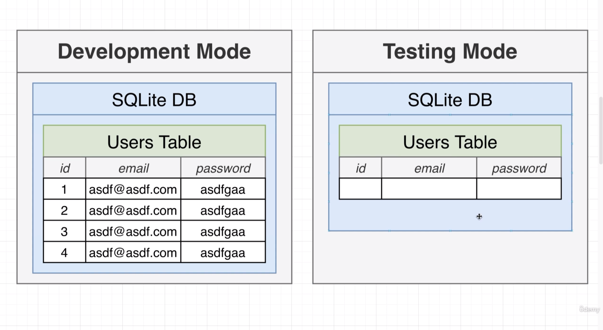

# Managing App Configuration

## 117 - Understanding Dotenv



## 118 - Applying Dotenv for Config
let's create a .env.development file
```env
DB_NAME=db.sqlite
```

let's create a .env.test file
```env
DB_NAME=db.sqlite
```
let's change the app.module.ts file
```ts

import { AppService } from './app.service';
import { UsersModule } from './users/users.module';
import { ReportsModule } from './reports/reports.module';
import { ConfigModule, ConfigService } from '@nestjs/config';
import { APP_PIPE } from '@nestjs/core';
import * as process from 'process';
import { TypeOrmModule } from '@nestjs/typeorm';
import { User } from './users/user.entity';
import { Report } from './reports/report.entity';
// eslint-disable-next-line @typescript-eslint/no-var-requires
const cookieSession = require('cookie-session');
@Module({
  imports: [
    ConfigModule.forRoot({
      isGlobal: true,
      envFilePath: `.env.${process.env.NODE_ENV}}`,
    }),
    TypeOrmModule.forRootAsync({
      inject: [ConfigService],
      useFactory: (config: ConfigService) => ({
        type: 'sqlite',
        database: config.get<string>('DB_NAME'),
        entities: [User, Report],
        synchronize: true,
      }),
    }),
    // TypeOrmModule.forRoot({
    //   type: 'sqlite',
    //   database: 'db.sqlite',
    //   entities: [User, Report],
    //   synchronize: true,
    // }),
    UsersModule,
    ReportsModule,
  ]
```

## 119 - Specifying the Runtime Environment.
let's add cross-env to the project
```bash
npm i cross-env
```
```json
  "scripts": {
    "build": "nest build",
    "format": "prettier --write \"src/**/*.ts\" \"test/**/*.ts\"",
    "start": "cross-env NODE_ENV=development nest start",
    "start:dev": "cross-env NODE_ENV=development nest start --watch",
    "start:debug": "cross-env NODE_ENV=development nest start --debug --watch",
    "start:prod": "node dist/main",
    "lint": "eslint \"{src,apps,libs,test}/**/*.ts\" --fix",
    "test": "cross-env NODE_ENV=test jest",
    "test:watch": "cross-env NODE_ENV=test jest --watch",
    "test:cov": "cross-env NODE_ENV=test jest --coverage",
    "test:debug": "cross-env NODE_ENV=test node --inspect-brk -r tsconfig-paths/register -r ts-node/register node_modules/.bin/jest --runInBand",
    "test:e2e": "cross-env NODE_ENV=test jest --config ./test/jest-e2e.json"
  },
  "dependencies": {
    "@nestjs/common": "^9.0.0",
    "class-transformer": "^0.5.1",
    "class-validator": "^0.14.0",
    "cookie-session": "^2.0.0",
    // new dependency
    "cross-env": "^7.0.3",
    "mysql2": "^3.2.0",
    "reflect-metadata": "^0.1.13",
    "rxjs": "^7.2.0",
```
let's remove the app.use() from the main.ts
```ts

async function bootstrap() {
  const app = await NestFactory.create(AppModule);
  await app.listen(3000);
}
```

let's fix a small bug in the app.module.ts
```ts

  imports: [
    ConfigModule.forRoot({
      isGlobal: true,
      envFilePath: `.env.${process.env.NODE_ENV}`,
    }),
    TypeOrmModule.forRootAsync({
      inject: [ConfigService],
        synchronize: true,
      }),
    }),
    UsersModule,
    ReportsModule,
  ],
```

update the .gitignore file
```gitignore
!.vscode/tasks.json
!.vscode/launch.json
!.vscode/extensions.json

# ENV files
.env.*
```

## 120 - Solving a SQLite Error
add the --maxWorkers=1
to jest e2e test script
```json

    "test:watch": "cross-env NODE_ENV=test jest --watch",
    "test:cov": "cross-env NODE_ENV=test jest --coverage",
    "test:debug": "cross-env NODE_ENV=test node --inspect-brk -r tsconfig-paths/register -r ts-node/register node_modules/.bin/jest --runInBand",
    "test:e2e": "cross-env NODE_ENV=test jest --config ./test/jest-e2e.json --maxWorkers=1"
  },
  "dependencies": {
    "@nestjs/common": "^9.0.0",
```

and update the env file
```env
DB_NAME=test.sqlite
```
## 121 - It Works

let's create a global before each
```ts
import { rm } from 'fs/promises';
import { join } from 'path';
global.beforeEach(async () => {
  try {
    await rm(join(__dirname, '..', 'test.sqlite'));
  } catch (e) {}
});
```

and update the jest-e2e.json file
```json
{
  "moduleFileExtensions": [
    "js",
    "json",
    "ts"
  ],
  "rootDir": ".",
  "testEnvironment": "node",
  "testRegex": ".e2e-spec.ts$",
  "transform": {
    "^.+\\.(t|j)s$": "ts-jest"
  },
  "setupFilesAfterEnv": [
    "<rootDir>/setup.ts"
  ]
}
```
## 122 - A Followup Test

```ts
        expect(email).toEqual(email);
      });
  });
  it('signup as a new user and get the signin user', async () => {
    const email = 'abcd@gmail.com';
    const user = await request(app.getHttpServer())
      .post('/auth/signup')
      .send({
        email,
        password: '123456',
      })
      .expect(201);
    const cookie = user.get('Set-Cookie');
    const { body } = await request(app.getHttpServer())
      .get('/auth/whoami')
      .set('Cookie', cookie)
      .expect(200);
    expect(body.email).toEqual(email);
  });
});
```
