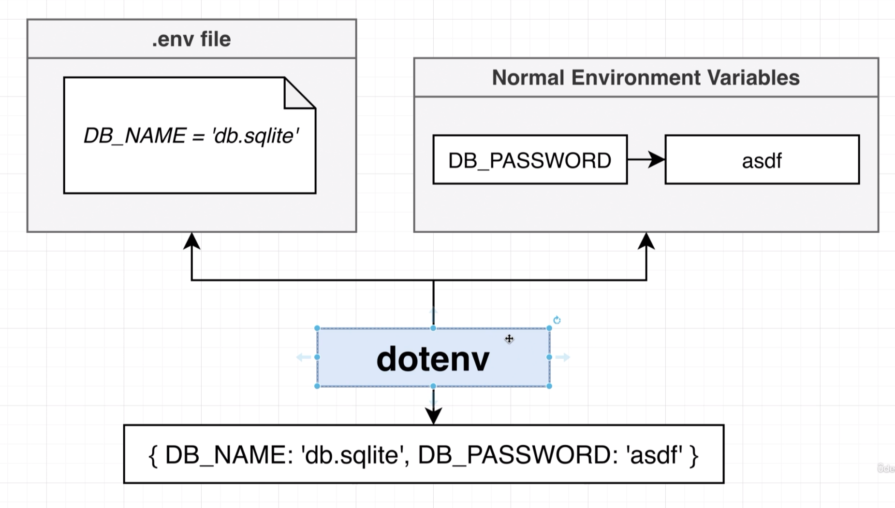
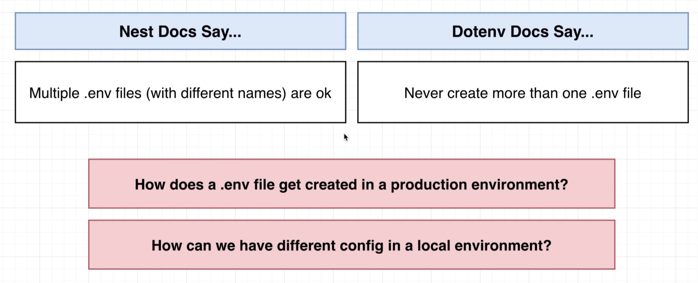

# Managing App Configuration

## 117 - Understanding Dotenv





## 118 - Applying Dotenv for Config
let's create a .env.development file
```env
DB_NAME=db.sqlite
```

let's create a .env.test file
```env
DB_NAME=db.sqlite
```
let's change the app.module.ts file
```ts

import { AppService } from './app.service';
import { UsersModule } from './users/users.module';
import { ReportsModule } from './reports/reports.module';
import { ConfigModule, ConfigService } from '@nestjs/config';
import { APP_PIPE } from '@nestjs/core';
import * as process from 'process';
import { TypeOrmModule } from '@nestjs/typeorm';
import { User } from './users/user.entity';
import { Report } from './reports/report.entity';
// eslint-disable-next-line @typescript-eslint/no-var-requires
const cookieSession = require('cookie-session');
@Module({
  imports: [
    ConfigModule.forRoot({
      isGlobal: true,
      envFilePath: `.env.${process.env.NODE_ENV}}`,
    }),
    TypeOrmModule.forRootAsync({
      inject: [ConfigService],
      useFactory: (config: ConfigService) => ({
        type: 'sqlite',
        database: config.get<string>('DB_NAME'),
        entities: [User, Report],
        synchronize: true,
      }),
    }),
    // TypeOrmModule.forRoot({
    //   type: 'sqlite',
    //   database: 'db.sqlite',
    //   entities: [User, Report],
    //   synchronize: true,
    // }),
    UsersModule,
    ReportsModule,
  ]
```

## 119 - Specifying the Runtime Environment
## 120 - Solving a SQLite Error
## 121 - It Works
## 122 - A Followup Test


