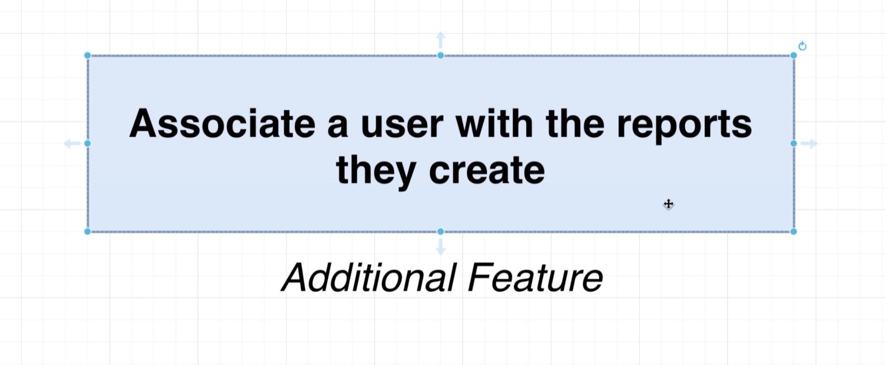
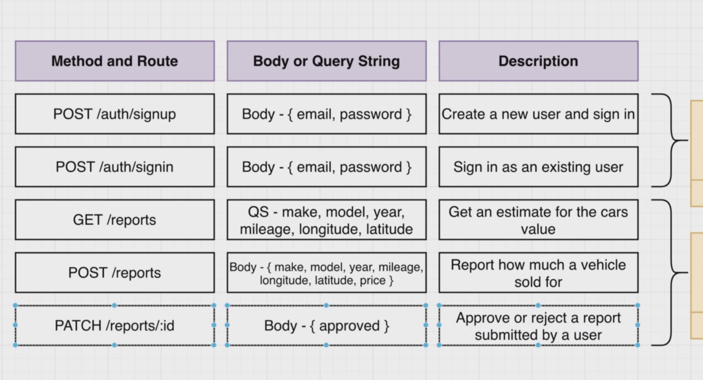
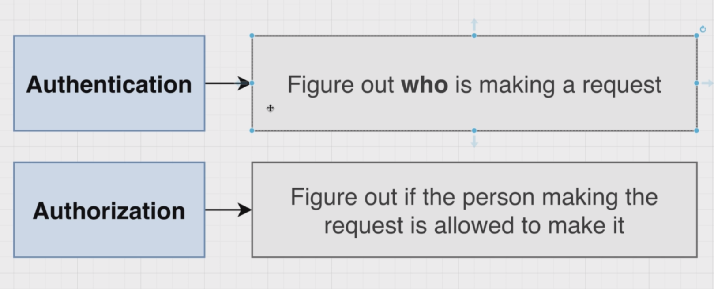
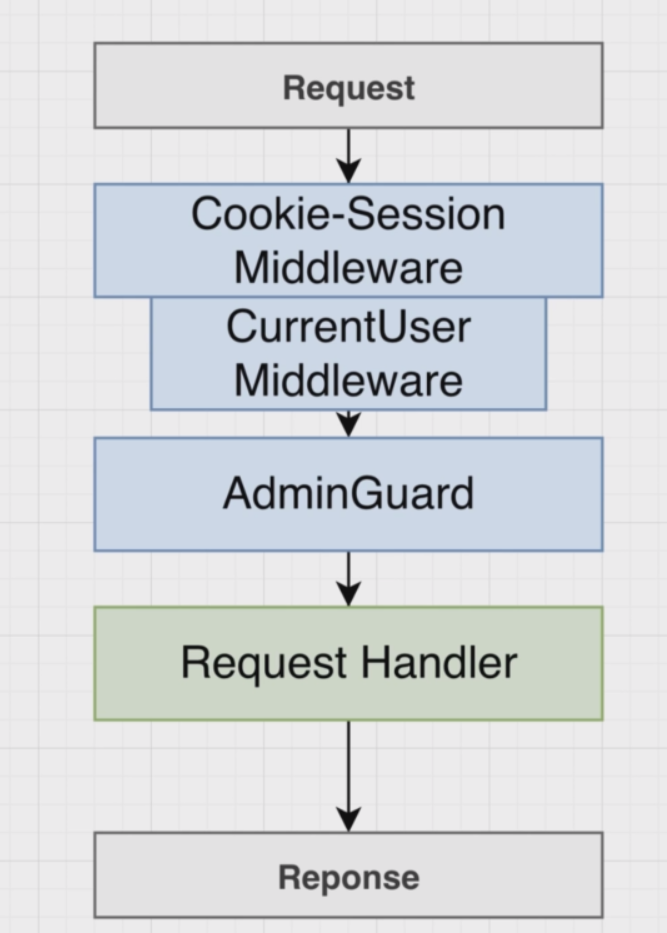
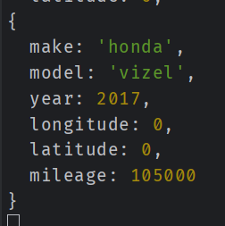
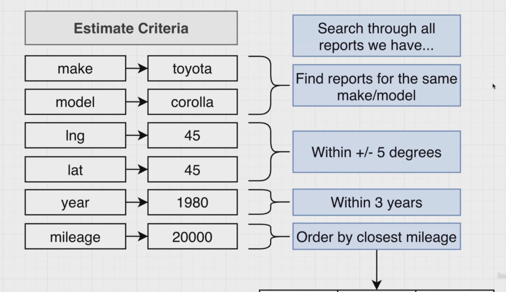
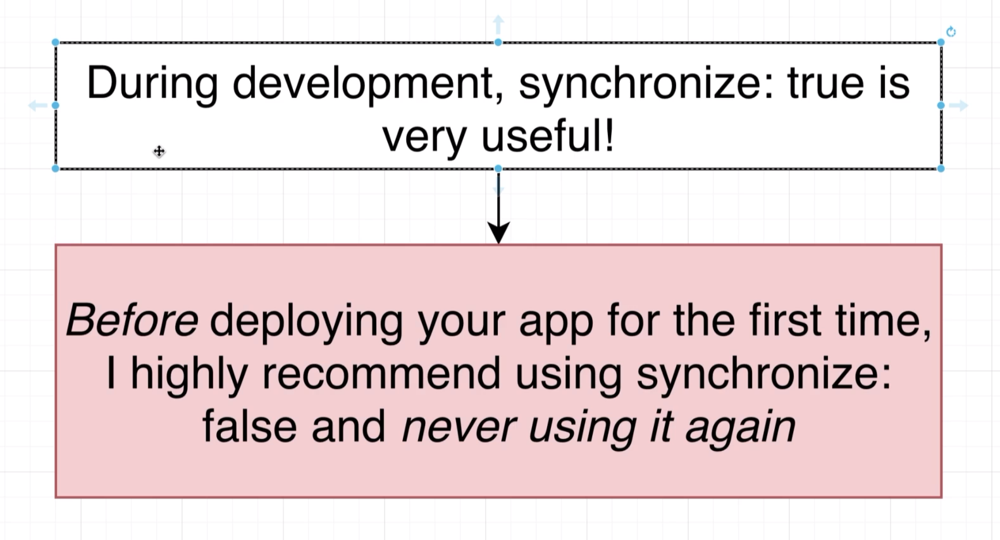
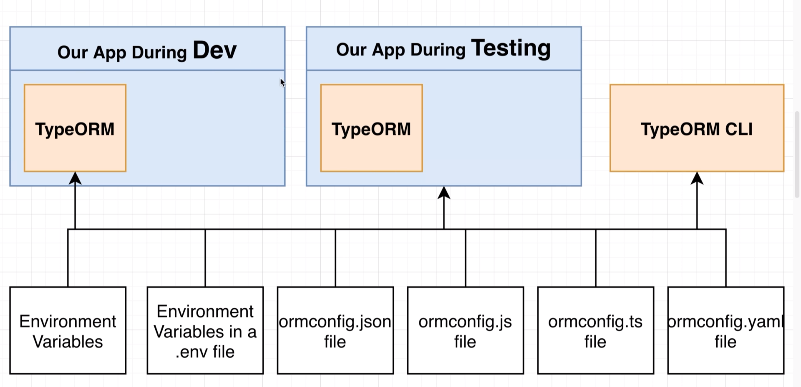
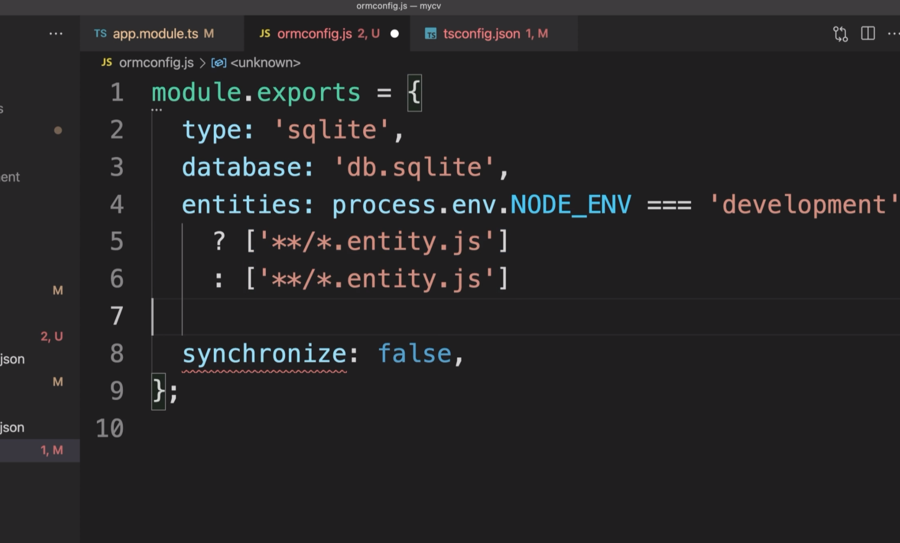

# Relations with TypeORM

## 123 - Back to Reports 


## 124 - Adding Properties to Reports
updating the Report entity
```ts

  id: number;
  @Column()
  price: number;
  @Column()
  make: string;
  @Column()
  model: string;
  @Column()
  year: number;
  @Column()
  longitude: number;
  @Column()
  latitude: number;
  @Column()
  mileage: number;
```
## 125 - A DTO for Report Creation


creating the create-user.dto.ts
```ts
export class CreateReportDto {
  price: number;

  make: string;

  model: string;

  year: number;

  longitude: number;

  latitude: number;

  mileage: number;
}

```

adding the DTO to the controller
```ts
import { Body, Controller, Post } from '@nestjs/common';
import { CreateReportDto } from './dtos/create-report.dto';

@Controller('reports')
export class ReportsController {
  @Post()
  createReport(@Body() body: CreateReportDto) {
    return 'This action adds a new report';
  }
}

```
## 126 - Receiving Report Creation Requests
let's add validation to the DTO
```ts
13 - Relations with TypeORM\src\reports\dtos\create-report.dto.ts
import {
  IsLatitude,
  IsLongitude,
  IsNumber,
  IsString,
  Max,
  Min,
} from 'class-validator';
export class CreateReportDto {
  @IsString()
  make: string;
  @IsString()
  model: string;
  @IsNumber()
  @Max(2050)
  @Min(1930)
  year: number;
  @IsLongitude()
  longitude: number;
  @IsLatitude()
  latitude: number;
  @IsNumber()
  @Max(1000000)
  @Min(0)
  price: number;
  @IsNumber()
  @Max(1000000)
  @Min(0)
  mileage: number;
}
```
let's add the guard to only allow authenticated users to create reports
```ts
13 - Relations with TypeORM\src\reports\reports.controller.ts
import { Body, Controller, Post, UseGuards } from '@nestjs/common';
import { CreateReportDto } from './dtos/create-report.dto';
import { ReportsService } from './reports.service';
import { AuthGuard } from '../guards/auth.guard';
@Controller('reports')
export class ReportsController {
  constructor(private readonly reportService: ReportsService) {}
  @Post()
  @UseGuards(AuthGuard)
  createReport(@Body() body: CreateReportDto) {
    this.reportService.create(body);
  }
}
```

sample report 
```ts
13 - Relations with TypeORM\src\reports\reports.service.ts
import { Injectable } from '@nestjs/common';
import { CreateReportDto } from './dtos/create-report.dto';
@Injectable()
export class ReportsService {
  create(body: CreateReportDto) {
    return 'This action adds a new report';
  }
}
```

## 127 - Saving a Report with the Reports Service
report service
```ts
import { Injectable } from '@nestjs/common';
import { CreateReportDto } from './dtos/create-report.dto';
import { InjectRepository } from '@nestjs/typeorm';
import { Report } from './report.entity';
import { Repository } from 'typeorm';
@Injectable()
export class ReportsService {
  constructor(
    @InjectRepository(Report) private reportsRepository: Repository<Report>,
  ) {}
  async create(reportDto: CreateReportDto) {
    const report = this.reportsRepository.create(reportDto);
    return await this.reportsRepository.save(report);
  }
}
```
returning the report
```ts
@Post()
  @UseGuards(AuthGuard)
  createReport(@Body() body: CreateReportDto) {
    return this.reportService.create(body);
  }
}
```
## 128 - Testing Report Creation
we need to sign in to make the request

if not


## 129 - Building Associations



## 130 - Types of Associations


## 131 - The ManyToOne and OneToMany Decorators
update the user entity
```ts
  AfterUpdate,
  Column,
  Entity,
  OneToMany,
  PrimaryGeneratedColumn,
} from 'typeorm';
import { Report } from '../reports/report.entity';
@Entity()
export class User {
  @Column()
  password: string;
  @OneToMany(() => Report, (report) => report.user)
  reports: Report[];
  @AfterInsert()
  logInsert() {
    console.log('Inserted user with id', this.id);
```

update report entity
```ts
import { Column, Entity, ManyToOne, PrimaryGeneratedColumn } from 'typeorm';
import { User } from '../users/user.entity';
@Entity()
export class Report {
  @Column()
  mileage: number;
  @ManyToOne(() => User, (user) => user.reports)
  user: User;
}
```
## 133 - More on Decorators


## 134 - Setting up the Association

## 135 - Formatting the Report Response
## 136 - Transforming Properties with a DTO























