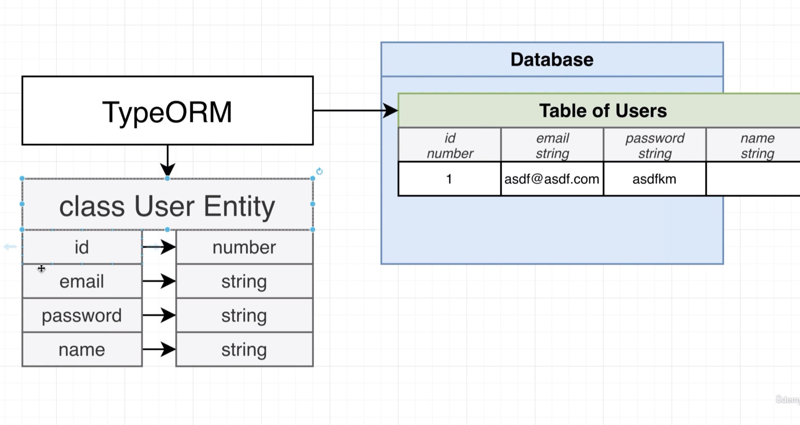
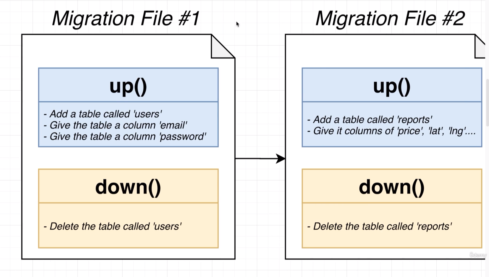
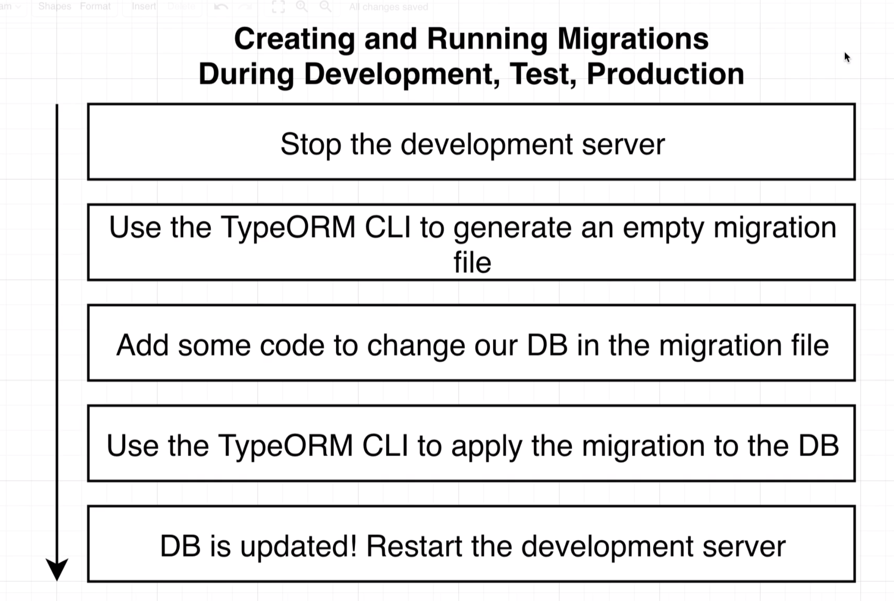
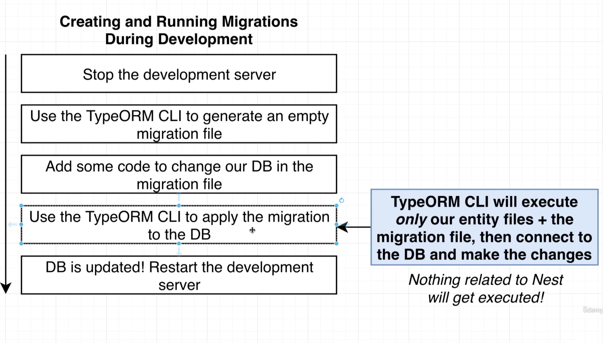
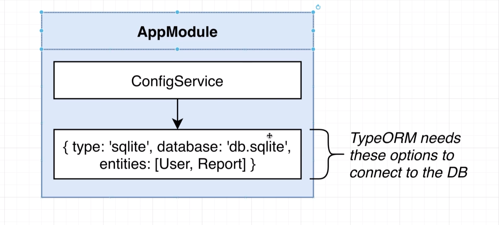
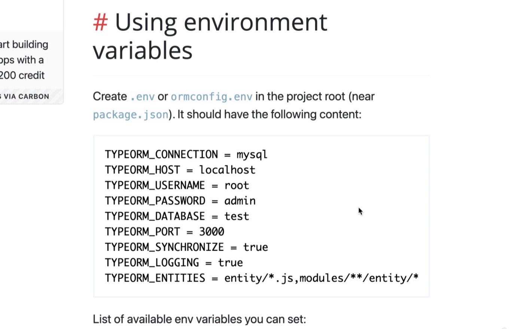

# Production Deployment
## 152 - The Path to Production 


## 153 - Providing the Cookie Key
let's add a cookie key to the env file
```ts
  ],
})
export class AppModule {
  constructor(private configService: ConfigService) {}
  configure(consumer: MiddlewareConsumer) {
    consumer
      .apply(
        cookieSession({
          keys: [this.configService.get<string>('COOKIE_KEY')],
        }),
      )
      .forRoutes('*');
```
## 154 - Understanding the Synchronize Flag



## 155 - The Dangers of Synchronize

## 156 - The Theory Behind Migrations


## 157 - Headaches with Config Management



## 158 - TypeORM and Nest Config is Great





## 159 - EnvSpecific Database Config


## 160 - Installing the TypeORM CLI
let's create a data source file 
```ts
import { DataSource, DataSourceOptions } from 'typeorm';
import * as process from 'process';
export const myDataSourceOptions: DataSourceOptions = {
  type: 'sqlite',
  database: process.env.DB_NAME || 'test.sqlite',
  entities: ['dist/src/**/*.entity.js'],
  migrations: ['dist/src/migrations/*.js'],
  synchronize: false,
};
const myDataSource = new DataSource(myDataSourceOptions);
export default myDataSource;
```

let's add a new script to the package.json
```json
    "test:watch": "cross-env NODE_ENV=test jest --watch",
    "test:cov": "cross-env NODE_ENV=test jest --coverage",
    "test:debug": "cross-env NODE_ENV=test node --inspect-brk -r tsconfig-paths/register -r ts-node/register node_modules/.bin/jest --runInBand",
    "test:e2e": "cross-env NODE_ENV=test jest --config ./test/jest-e2e.json --maxWorkers=1",
    "typeorm": "typeorm-ts-node-esm"
  },
  "dependencies": {
    "@nestjs/common": "^9.0.0",
    "supertest": "^6.1.3",
    "ts-jest": "^29",
    "ts-loader": "^9.2.3",
    "ts-node": "^10.9.1",
    "tsconfig-paths": "4.2.0",
    "typescript": "^4"
  },
```


## 161 - Generating and Running Migrations
let's generate a empty migration file
```bash
typeorm migration:create ./db/migrations/InitialSchema 
```
generated migration
```ts
import { MigrationInterface, QueryRunner } from "typeorm"

export class InitialSchema1680856502015 implements MigrationInterface {

    public async up(queryRunner: QueryRunner): Promise<void> {
    }

    public async down(queryRunner: QueryRunner): Promise<void> {
    }

}
```

let's genarate the migration file

this will create a migration file in the db/migrations folder
```ts
import { MigrationInterface, QueryRunner } from 'typeorm';

export class Initial1680860477262 implements MigrationInterface {
  name = 'Initial1680860477262';

  public async up(queryRunner: QueryRunner): Promise<void> {
    await queryRunner.query(
      `CREATE TABLE "report" ("id" integer PRIMARY KEY AUTOINCREMENT NOT NULL, "price" integer NOT NULL, "make" varchar NOT NULL, "model" varchar NOT NULL, "year" integer NOT NULL, "approved" boolean NOT NULL DEFAULT (0), "longitude" integer NOT NULL, "latitude" integer NOT NULL, "mileage" integer NOT NULL, "userId" integer)`,
    );
    await queryRunner.query(
      `CREATE TABLE "user" ("id" integer PRIMARY KEY AUTOINCREMENT NOT NULL, "email" varchar NOT NULL, "password" varchar NOT NULL, "isAdmin" boolean NOT NULL DEFAULT (1))`,
    );
    await queryRunner.query(
      `CREATE TABLE "temporary_report" ("id" integer PRIMARY KEY AUTOINCREMENT NOT NULL, "price" integer NOT NULL, "make" varchar NOT NULL, "model" varchar NOT NULL, "year" integer NOT NULL, "approved" boolean NOT NULL DEFAULT (0), "longitude" integer NOT NULL, "latitude" integer NOT NULL, "mileage" integer NOT NULL, "userId" integer, CONSTRAINT "FK_e347c56b008c2057c9887e230aa" FOREIGN KEY ("userId") REFERENCES "user" ("id") ON DELETE NO ACTION ON UPDATE NO ACTION)`,
    );
    await queryRunner.query(
      `INSERT INTO "temporary_report"("id", "price", "make", "model", "year", "approved", "longitude", "latitude", "mileage", "userId") SELECT "id", "price", "make", "model", "year", "approved", "longitude", "latitude", "mileage", "userId" FROM "report"`,
    );
    await queryRunner.query(`DROP TABLE "report"`);
    await queryRunner.query(
      `ALTER TABLE "temporary_report" RENAME TO "report"`,
    );
  }

  public async down(queryRunner: QueryRunner): Promise<void> {
    await queryRunner.query(
      `ALTER TABLE "report" RENAME TO "temporary_report"`,
    );
    await queryRunner.query(
      `CREATE TABLE "report" ("id" integer PRIMARY KEY AUTOINCREMENT NOT NULL, "price" integer NOT NULL, "make" varchar NOT NULL, "model" varchar NOT NULL, "year" integer NOT NULL, "approved" boolean NOT NULL DEFAULT (0), "longitude" integer NOT NULL, "latitude" integer NOT NULL, "mileage" integer NOT NULL, "userId" integer)`,
    );
    await queryRunner.query(
      `INSERT INTO "report"("id", "price", "make", "model", "year", "approved", "longitude", "latitude", "mileage", "userId") SELECT "id", "price", "make", "model", "year", "approved", "longitude", "latitude", "mileage", "userId" FROM "temporary_report"`,
    );
    await queryRunner.query(`DROP TABLE "temporary_report"`);
    await queryRunner.query(`DROP TABLE "user"`);
    await queryRunner.query(`DROP TABLE "report"`);
  }
}
```

then add the genarated migration file to the data source
```ts
import { DataSource, DataSourceOptions } from 'typeorm';
import * as process from 'process';
import { User } from '../src/users/user.entity';
import { Report } from '../src/reports/report.entity';
import { Initial1680860477262 } from './migrations/1680860477262-Initial';

export const myDataSourceOptions: DataSourceOptions = {
  type: 'sqlite',
  database: process.env.DB_NAME || 'db.sqlite',
  entities: [User, Report],
  migrations: [Initial1680860477262],
  synchronize: false,
};

const myDataSource = new DataSource(myDataSourceOptions);
export default myDataSource;
```
and run the migration
```bash
typeorm migration:run -d ./dist/db/app-data-source
```

## 163 - Running Migrations During E2E Tests
create a migration file
```bash
typeorm migration:create ./db/migrations/InitialSchema -d ./dist/db/app-data-source
```
## 164 - Production DB Config
## 166 - Heroku Specific Project Config
## 166 - Heroku Specific Project Config_DV
## 167 - Deploying the App Final Lecture


